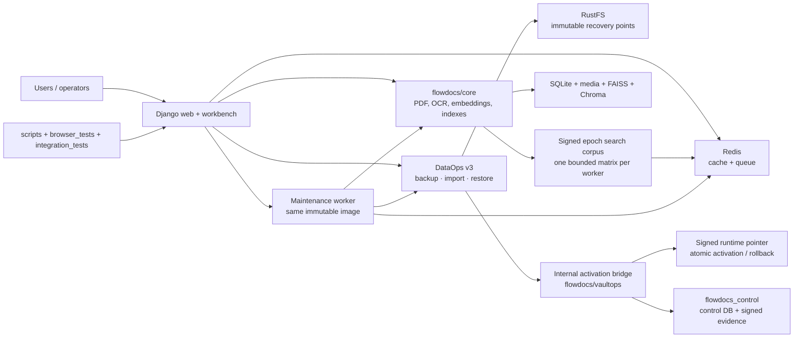

Status: Active
Audience: Developer
Owner: FlowDocs maintainers
Last verified: 2026-08-07
Canonical source: README.md
Supersedes: None

# FlowDocs PDF Search

[](https://github.com/Nimble-esolutions/PdfSearch/actions/workflows/docker-build.yml)
[](https://github.com/Nimble-esolutions/PdfSearch/actions/workflows/docs-contract.yml)

FlowDocs is a Django application for authorized users to upload PDF documents,
organize them into folders, and search them with natural-language questions. It
supports English, Marathi, and Hindi document processing: native PDF extraction
is preferred, with bounded local Tesseract OCR for scanned pages, followed by
the existing embedding and retrieval workflow.

> **Current operational state:** `https://2026.ai-sahakar.net` is the active
> non-production stage/rehearsal host and serves a signed runtime. Legacy
> `https://www.ai-sahakar.net` remains the authoritative production service and
> is unchanged. The future 2026 production deployment has not been created or
> cut over. Read the living [project handoff](docs/HANDOFF.md) for exact current
> generations, counts, image digests, and recovery evidence.

## Start Here

Use the route that matches the work:

- Local development: [`docker-compose.dev.yml`](docker-compose.dev.yml) and [`docs/INDEX.md`](docs/INDEX.md#local-development)
- Dokploy deployment: [`DEPLOYMENT_GUIDE.md`](DEPLOYMENT_GUIDE.md)
- Dokploy data persistence and safe redeploys: [`docs/DOKPLOY_DATA_PERSISTENCE.md`](docs/DOKPLOY_DATA_PERSISTENCE.md)
- Release promotion: [`docs/BUILD_AND_RELEASE_ROADMAP.md`](docs/BUILD_AND_RELEASE_ROADMAP.md)
- Production baseline: [`docs/PRODUCTION_BASELINE.md`](docs/PRODUCTION_BASELINE.md)
- Data custody and recovery: [`docs/dataops/V3_ARCHITECTURE.md`](docs/dataops/V3_ARCHITECTURE.md), [`docs/DATA_CUSTODY_AND_PROMOTION.md`](docs/DATA_CUSTODY_AND_PROMOTION.md), [`docs/OPERATIONS_RUNBOOK.md`](docs/OPERATIONS_RUNBOOK.md), and the historical [`docs/RUSTFS_RECOVERY_VAULT.md`](docs/RUSTFS_RECOVERY_VAULT.md) rehearsal evidence
- FAISS compatibility: [`docs/FAISS_COMPATIBILITY.md`](docs/FAISS_COMPATIBILITY.md)
- Incident response: [`docs/OPERATIONS_RUNBOOK.md`](docs/OPERATIONS_RUNBOOK.md)
- Client usage: [`docs/CLIENT_USER_MANUAL.md`](docs/CLIENT_USER_MANUAL.md)
- Public/admin design lock: [`docs/design/AI_SAHAKAR_UI_CONTRACT.md`](docs/design/AI_SAHAKAR_UI_CONTRACT.md)
- Developer UI guide: [`docs/AI_SAHAKAR_DEVELOPER_GUIDE.md`](docs/AI_SAHAKAR_DEVELOPER_GUIDE.md)
- Admin user guide: [`docs/AI_SAHAKAR_ADMIN_USER_GUIDE.md`](docs/AI_SAHAKAR_ADMIN_USER_GUIDE.md)
- Settings operations: [`docs/SETTINGS_OPERATIONS.md`](docs/SETTINGS_OPERATIONS.md)
- Multi-file intake and document lifecycle: [`docs/DOCUMENT_INTAKE_WORKBENCH.md`](docs/DOCUMENT_INTAKE_WORKBENCH.md)
- Privacy-bounded product analytics and self-hosted Umami boundary: [`docs/PRODUCT_ANALYTICS_RECOMMENDATION.md`](docs/PRODUCT_ANALYTICS_RECOMMENDATION.md), [`plans/032-pilot-privacy-first-product-analytics.md`](plans/032-pilot-privacy-first-product-analytics.md)
- `dev` cleanup scope: [`docs/DEV_CLEANUP_SCOPE.md`](docs/DEV_CLEANUP_SCOPE.md)
- Environment impact guide and reviewed examples: [`docs/ENVIRONMENT_CONFIGURATION_GUIDE.md`](docs/ENVIRONMENT_CONFIGURATION_GUIDE.md), [`docs/environments/`](docs/environments/)
- Contribution and dev-to-release workflow: [`CONTRIBUTING.md`](CONTRIBUTING.md)
- Documentation map and historical context: [`docs/INDEX.md`](docs/INDEX.md)
- Current project handoff: [`docs/HANDOFF.md`](docs/HANDOFF.md)

## Prerequisites

For the complete environment-variable reference, see
[docs/ENVIRONMENT_REFERENCE.md](docs/ENVIRONMENT_REFERENCE.md).

Current operational references:

- [living current handoff](docs/HANDOFF.md)
- [2026-08-03 status snapshot](docs/STATUS-2026-08-03.md)
- [2026-08-02 migration snapshot](docs/STATUS-2026-08-02.md)
- [dated operations changelog](docs/OPERATIONS_CHANGELOG-2026-08-02.md)
- [legacy-versus-current state](docs/LEGACY_VS_CURRENT_STATE.md)

- Docker Engine with the Compose plugin
- A local `.env` created from [`.env.example`](.env.example)
- Environment details from [`docs/ENVIRONMENT_CONTRACT.md`](docs/ENVIRONMENT_CONTRACT.md)
- Local-only credentials when search or external integrations are exercised

Never copy production secrets or production data into a local environment.

## Local Development

```bash
cp .env.example .env
# Set local values; never use production secrets.
LOCAL_BUILD_REVISION="$(git rev-parse --short HEAD)" \
  docker compose -f docker-compose.dev.yml up -d --build --wait
```

The development Compose file uses `flowdocs_data_dev` and `redis_data_dev`.
It does not mount the production legacy volume. Stop local services with
`docker compose -f docker-compose.dev.yml stop`; do not use `down -v` when data
needs to be retained.

## Product surfaces and design lock

The public `/` route defaults to **Classic search**, the approved
`training.ai-sahakar.net` service composition rebuilt without CDN Bootstrap,
inline application JavaScript, unsafe HTML insertion, or heavy bitmap assets.
The **Knowledge Workbench** remains an isolated secondary frontend and can be
previewed with `/?view=workbench`. A superadmin can choose the primary view in
Settings; URL previews never persist. Both views share the same secured Django
search/PDF backend and complete English/Marathi session behavior, but not
templates, presentation CSS, or frontend JavaScript.

Answer language is derived from each question, not from the selected theme or
page locale. Marathi questions produce Marathi answers and English questions
produce English answers. The backend validates the dominant script before
caching, permits one bounded repair attempt, and fails explicitly rather than
presenting a wrong-language response as successful.

The public information pages at `/privacy/`, `/terms/`, `/data-policy/`,
`/cookies/`, and `/disclaimer/` follow the same saved or explicitly previewed
theme. They use a standalone public document shell—never the authenticated
admin layout—and preserve only allowlisted `?view=classic|workbench` previews
across policy navigation and language switching.

The authenticated surface remains the **Operations Cockpit** admin UI.
Public-theme selection is the only admin change in this feature.

Read the [active UI contract](docs/design/AI_SAHAKAR_UI_CONTRACT.md) before
changing templates, CSS, JavaScript, translations, browser tests, or visual
documentation. The tracked agent skill is
[`skills/ai-sahakar-ui-contract/SKILL.md`](skills/ai-sahakar-ui-contract/SKILL.md).
The isolation and selection boundary is documented in
[`docs/design/PUBLIC_SEARCH_THEME_ARCHITECTURE.md`](docs/design/PUBLIC_SEARCH_THEME_ARCHITECTURE.md).

## Architecture

The deployed system has four cooperating boundaries:

1. **Application plane** — Django/Gunicorn web, maintenance worker, Redis
   cache/queue, SQLite, media, FAISS, Chroma, and PDF cache.
2. **Control plane** — durable control SQLite, signed activation intent,
   runtime-generation pointers, evidence, leases, and recovery journals.
3. **Recovery plane** — RustFS immutable, dataset-scoped manifests and
   content-addressed objects accessed through explicit Data Operations profiles.
4. **External AI plane** — local OCR first; extracted text may use the existing
   embedding provider under the configured side-effect policy. Original PDFs
   never leave custody because OCR is local.

Current visual sources:
[runtime-topology.mmd](docs/diagrams/runtime-topology.mmd),
[data-custody-promotion.mmd](docs/diagrams/data-custody-promotion.mmd),
[deployment-flow.mmd](docs/diagrams/deployment-flow.mmd), and
[ocr-index-lifecycle.mmd](docs/diagrams/ocr-index-lifecycle.mmd). Dated
legacy-to-stage evidence is intentionally separate in
[legacy-to-stage-2026.mmd](docs/diagrams/legacy-to-stage-2026.mmd) and
[stage-recovery-state.mmd](docs/diagrams/stage-recovery-state.mmd). The current
search request/cache boundary is shown in
[search-answer-hot-path.mmd](docs/diagrams/search-answer-hot-path.mmd) and its
[rendered SVG](docs/diagrams/search-answer-hot-path.svg). Public UI and
change-control views are available as editable Mermaid sources and rendered
SVGs: [public shell source](docs/diagrams/ui-shell-and-evidence.mmd),
[public shell visual](docs/diagrams/ui-shell-and-evidence.svg),
[change-control source](docs/diagrams/ui-change-control.mmd), and
[change-control visual](docs/diagrams/ui-change-control.svg).

### Repository map: where to start

| Area | Owns | Start with |
| --- | --- | --- |
| Django shell | settings, URLs, WSGI/ASGI, runtime paths | flowdocs/flowdocs/ |
| Core application and document intelligence | environment identity, upload intake, PDF extraction, OCR fallback, chunking, embeddings, FAISS/Chroma, document lifecycle, and safety gates | flowdocs/core/ |
| Data Operations v3 | the only supported operator workbench; backup, import, restore, recovery points, policy, and readiness | flowdocs/dataops/ |
| Internal recovery compatibility | durable legacy control records, selected search-maintenance endpoints, and the signed runtime-activation bridge; not a separate operator product | flowdocs/vaultops/ |
| Delivery and operations | migration, recovery certification, CI contracts, parity checks | scripts/ |
| Verification | browser behavior, RustFS/MinIO lifecycle, restore and process-death gates | browser_tests/ and integration_tests/ |
| Documentation | contracts, runbooks, evidence, architecture and lifecycle diagrams | docs/ |

For a change, identify the owning row first, then trace callers and tests
before editing. The graph-backed architecture query is the source for this
grouping; the tree below is a navigation aid, not a claim that every file has
the same runtime role.



DataOps v3 is the product and operator-language boundary. The `vaultops`
package has **not** been deleted: its control schema, compatibility API,
selected maintenance handlers, and activation/runtime primitives are still
installed and tested. They are implementation details and cleanup debt, not a
second workbench or a configuration path that operators should assemble. The
retired `/dashboard/operations/vault/` page redirects to the current DataOps
workbench.

### Search hot path

Public search checks an exact, access-scoped result cache before paying for an
embedding, vector retrieval, or answer-generation request. When signed
activation and the existing durable mutation tracker agree, each web worker
parses and normalizes one bounded corpus for the current mutation epoch, then
filters that matrix to the caller's authorized folder/PDF scope. Unsigned,
untracked, changing, oversized, or corrupt data retains the conservative
per-folder snapshot path. Cached references are reauthorized; failures in the
search-result/embedding/answer caches degrade speed, while the separate public
rate limiter remains fail-closed. Query embeddings and generated answers are
provider-scoped;
cache keys also bind the models, language, runtime, answer-contract version,
and authorization scope. See the
[latency root-cause and impact record](docs/releases/2026-08-07-search-answer-latency.md).

### Project structure

    flowdocs/
      flowdocs/       Django settings, URLs, WSGI/ASGI, runtime configuration
      core/           application models, PDF/OCR/search, environment and lifecycle safety
      dataops/        operator workbench and v3 backup/import/restore lifecycle
      vaultops/       internal compatibility schema, maintenance API, activation bridge
      locale/         application translation assets
    scripts/
      ci/             contract, parity, lifecycle, and release checks
      ops/            migration, recovery certification, and operator utilities
      runtime/        runtime and maintenance helper scripts
    browser_tests/    Playwright public, admin, search, and workbench gates
    integration_tests/ RustFS/MinIO, restore, activation, process-death tests
    docs/
      diagrams/       Mermaid architecture and lifecycle sources
      dataops/        Data Operations contracts and rollout procedures
      environments/   reviewed non-secret environment examples
      HANDOFF.md      living current operational authority
      STATUS-*.md     dated historical operational evidence
    init/             declared seed database and image-provided index assets
    Dockerfile        immutable application image definition
    docker-compose*.yml  local, CI, integration, recovery, and Dokploy contracts
    requirements-web.txt / requirements-web.lock  input and hashed dependencies

Keep mutable data in named volumes, application code in the image, and
operational evidence in the control boundary. Do not treat init assets,
browser reports, local graph output, or generated indexes as interchangeable
with the production data volume.

```text
web container
  /app/flowdocs              immutable Django application code from the image
  /app/data                  mutable application data
    db.sqlite3
    media/
    faiss_indexes/
    chroma_db/
    staticfiles/
    backups/
    .instance_id             stable instance identity
  /app/data-control          activation control plane
    runtime/active.json      signed active-generation pointer
    runtime/previous.json    rollback-generation pointer
    activation/intents/      signed activation requests
    activation/acks/         web/worker coordination evidence
    activation/results/      signed activation or rollback results
    activation/activation.lock  activation serialization lock

  /app/data/runtime-generations/  immutable projected generations
  /app/data/restore-quarantine/   isolated restore candidates

redis container
  /data                      cache/queue persistence in redis_data
```

Production Compose mounts `flowdocs_data` at `/app/data`. The external
`prod_flowdocs` volume at `/mnt/legacy:ro` is legacy evidence/quarantine only; it
is not an automatic import source. Legacy and active data must not be copied
directly or treated as one database. Promotion requires inventory, conflict
classification, staged restore, FAISS fingerprint validation, and an explicit
operator decision. It must never mount persistent data over `/app/flowdocs`.

Key new modules (2026-07-24): `core/environment.py` (startup identity validation),
`core/side_effects.py` (external call gating), `core/ai_guard.py` (OpenAI containment),
`core/activate.py` (atomic generation activation), `core/restore_pipeline.py`
(download→validate→sanitize→rehearse→activate), `core/global_writer.py` (CAS writer
fencing), `core/registration.py` (dataset registration), `core/backup_policy.py`
(dirty-state tracking), `core/sanitize.py` (PII sanitization), `core/rehearsal.py`
(migration rehearsal), `core/activation_journal.py` (crash recovery),
`core/lease.py` (writer lease), `core/compatibility.py` (pre-activation checks),
`core/metrics.py` (Prometheus), `core/namespace.py` (S3 key builder),
`core/object_store_capabilities.py` (S3 capability probing).
See [`docs/ARCHITECTURE_OVERVIEW.md`](docs/ARCHITECTURE_OVERVIEW.md) for the full map.

## Production Contract

Legacy `https://www.ai-sahakar.net` is the current authoritative production
service. `https://2026.ai-sahakar.net` is the active non-production
stage/rehearsal deployment of this repository. The future 2026 production
Compose application and its intended `ai-sahakar.net` / `www.ai-sahakar.net`
cutover do not exist yet; [`docker-compose.yml`](docker-compose.yml) is their
deployment template, not proof of a completed deployment. Runtime/search
readiness and backup rehearsal evidence are independent: a disposable stage
backup receipt is useful recovery proof, but is not an availability
prerequisite unless policy explicitly requires it.

- Container port: `8000`
- Liveness: `/livez` proves process liveness
- Readiness: `/readyz` checks database, configured cache, migrations, data state, and backup status
- Health: `/health/data/` (generation status), `/health/lease/` (writer lease), `/health/metrics/` (Prometheus)
- Redis: production Compose pins the web service to `redis://redis:6379/1`;
  do not override it with `localhost`, which points back to the web container
- Persistent state: Compose volume `flowdocs_data` at `/app/data`
- Legacy data: external `prod_flowdocs` at `/mnt/legacy:ro`, read-only quarantine only
- Secrets: Dokploy protected environment values
- Stage image channel: `ghcr.io/nimble-esolutions/pdfsearch/shakar-frontend:latest`
- Stage evidence: record the resolved running digest after every pull/deploy
- Production release identity: `ghcr.io/nimble-esolutions/pdfsearch/shakar-frontend@sha256:<digest>`
- Pull policy: the effective Dokploy Compose configuration must use `pull_policy: always`

The 2026 stage deliberately tracks `:latest` through `PDFSEARCH_IMAGE`; Compose
passes that reference to the application as its image marker. `pull_policy:
always` plus the separately resolved container digest provides deployment
evidence. Production must instead set
`PDFSEARCH_IMAGE` to an approved immutable digest. Never infer the running
artifact from a tag alone.

Deploying a new image normally recreates the container while retaining the
Compose-managed `/app/data` named volume. This is conditional on preserving the
Dokploy project and volume mapping; deleting the project, changing the project
or volume name, or using `down -v` can create an empty volume or delete data.
Read [`DOKPLOY_DATA_PERSISTENCE.md`](docs/DOKPLOY_DATA_PERSISTENCE.md) before
enabling autodeploy or pressing Deploy.

## Current Data-Custody Boundary

The legacy production volume remains read-only evidence. DataOps v3 is the
only supported operator contract for publishing complete recovery points,
importing foreign or legacy sources, restoring to quarantine, testing recovery,
and requesting stage activation. It uses one environment-owned recovery
connection and decides same-dataset restore versus foreign import/rebind from
verified provenance. Activation remains a separate signed compare-and-swap
operation; failed readiness restores the previous signed pointer.

Stage is reachable at `https://2026.ai-sahakar.net`; healthy containers and a
root response do not replace `/readyz`. Exact counts, lineage identifiers,
manifest digests, backup receipts, and the running image are intentionally kept
out of this active architecture summary. Use [docs/HANDOFF.md](docs/HANDOFF.md)
for living evidence and the dated status/incident documents for historical
observations. The original Vault/RustFS rehearsal remains historical evidence
in [`RUSTFS_RECOVERY_VAULT.md`](docs/RUSTFS_RECOVERY_VAULT.md), not current
operator instructions.

## Verification Gates

Every documentation or release change must pass the applicable link/path scan,
Mermaid validation, and change-specific checks. Representative deployment
gates include `docker compose -f docker-compose.yml config`, `/livez`,
`/readyz`, database/media/index reconciliation, and multilingual search. This
is not an exhaustive test inventory; use the exact CI workflow and running
image for the complete gate set. Record the source SHA, exact image digests,
Compose evidence, data snapshot/checksum references, and explicit promotion
decision.

## Security and Recovery Warnings

Production requires an explicit `SECRET_KEY`, `DEBUG=False`, explicit
`ALLOWED_HOSTS`, secure cookies, and protected API credentials. Do not commit
`.env` files, API keys, passwords, or copied production data.

Do not run `docker compose down -v` against production. It can remove named
volumes and destroy the recovery set. Back up and restore into an isolated
volume or disposable Dokploy application instead.

Treat generated answers as assistance. Review source references before making an
official decision.

## Contribution and Release Links

- Deployment contract: [`DEPLOYMENT.md`](DEPLOYMENT.md)
- Operating rules: [`docs/PRODUCTION_OPERATING_RULES.md`](docs/PRODUCTION_OPERATING_RULES.md)
- Release evidence: [`docs/BUILD_AND_RELEASE_ROADMAP.md`](docs/BUILD_AND_RELEASE_ROADMAP.md)
- Persistent data contract: [`docs/PERSISTENT_DATA_RELEASE.md`](docs/PERSISTENT_DATA_RELEASE.md)
- Client manual: [`docs/CLIENT_USER_MANUAL.md`](docs/CLIENT_USER_MANUAL.md)
- UI guides: [`docs/AI_SAHAKAR_DEVELOPER_GUIDE.md`](docs/AI_SAHAKAR_DEVELOPER_GUIDE.md) and [`docs/AI_SAHAKAR_ADMIN_USER_GUIDE.md`](docs/AI_SAHAKAR_ADMIN_USER_GUIDE.md)
- Historical documents and supersession map: [`docs/INDEX.md`](docs/INDEX.md#historical-context)

Update the client manual in the same change as user-visible behavior changes;
keep deployment and operator procedures out of it.

The canonical local stack builds one `pdfsearch-dev:local` application image
for web, maintenance, and bucket initialization, and starts pinned RustFS on
localhost-only ports. Stage and production instead pull one immutable image
digest and use externally operated RustFS. MinIO is retained only as a
separately named S3 compatibility test; it is not RustFS certification. Native
local builds set `APP_RELEASE_VERSION` from `LOCAL_BUILD_REVISION` and leave
`APP_IMAGE_DIGEST` empty. Existing MinIO and RustFS volumes are never reused or
removed automatically.
