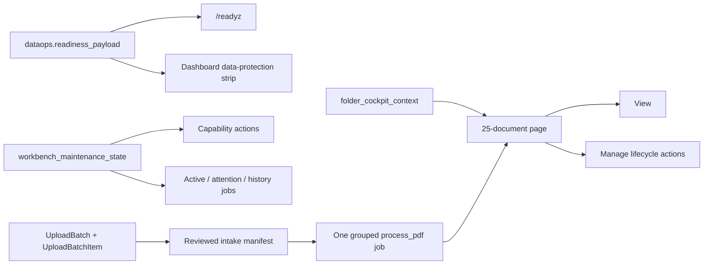
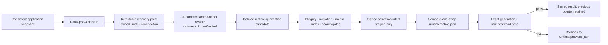

# PdfSearch Architecture Overview

**Status:** Active
**Audience:** Developer, Operator
**Owner:** FlowDocs maintainers
**Last verified:** 2026-08-06
**Canonical source:** docs/ARCHITECTURE_OVERVIEW.md

Primary knowledge transfer artifact for the PdfSearch system. Read this first.

## Current architecture state

The current system is best understood as four cooperating planes:

| Plane | Responsibility | Durable boundary |
| --- | --- | --- |
| Application | Django web, maintenance, SQLite, media, FAISS, Chroma, cache | stage/production data volume |
| Control | signed activation intent, generation pointer, leases, journals, evidence | paired control volume |
| Recovery | RustFS profiles, manifests, content-addressed objects, receipts | dataset-scoped buckets |
| External AI | local OCR first, configured embeddings and answer preparation | side-effect policy and provider boundary |

DataOps v3 is the sole supported operator contract for backup, import, restore,
recovery testing, and recovery readiness. The `vaultops` Django application is
still installed as internal compatibility infrastructure: selected maintenance
endpoints, durable legacy control records, and the signed activation/runtime
bridge still depend on it. It is not a second operator workbench. Exact live
deployment evidence belongs in [HANDOFF.md](HANDOFF.md); dated status documents
are historical evidence and do not define the current architecture.

### Current custody topology

    legacy prod_flowdocs (read-only)
      -> v2 source dataset ai-sahakar-prod-v2
      -> clone/rebind
      -> stage dataset ai-sahakar-stage-2026
      -> restore-quarantine
      -> signed runtime-generations pointer
      -> stage_2026 backup
      -> disposable round-trip volumes

The runtime pointer is the authority. A RustFS object, quarantine workspace,
database row, or container health status cannot activate a generation alone.

---

## 1. System Overview

PdfSearch is an AI-powered document search platform for Maharashtra Cooperative
Societies legal documents. It ingests PDFs, extracts text, generates OpenAI
embeddings, builds FAISS vector indexes, and serves natural-language search
with role-based access control.

| Layer | Technology |
|-------|-----------|
| Web framework | Django 5.x (Gunicorn WSGI) |
| Database | SQLite (single-writer, file-based) |
| Vector search | FAISS (in-process, file-based indexes) |
| Cache / locking | Redis 7 |
| Object store | S3-compatible (RustFS / MinIO), opt-in |
| Container runtime | Docker Compose (not Swarm) |
| Reverse proxy | Traefik (Dokploy-managed, Let's Encrypt TLS) |
| Deployment | Dokploy GitHub-connected application |
| AI | OpenAI (text-embedding-3-small, gpt-4o-mini) |
| i18n | English (Indian) + Marathi |

**Role-based access:**
- `superadmin` — full access including operations dashboard, data lifecycle, user management
- `admin` — folder/PDF management, user registration
- `user` — search, view assigned folders

**Public surface:** Anonymous search is enabled by default for the public corpus
(`PUBLIC_SEARCH_ENABLED=1`). `/register/` always requires authenticated `admin`
or `superadmin`.

The public presentation resolver accepts only `classic` and `workbench`. A
request-only `?view=` preview wins for that response; otherwise the allowlisted
`PUBLIC_SEARCH_PRIMARY_VIEW` site setting applies, with Classic as the
fail-closed default. Search pages keep isolated template/CSS/JavaScript stacks.
The `/terms/`, `/privacy/`, `/disclaimer/`, `/data-policy/`, and `/cookies/`
routes reuse only the selected theme's header partial inside a standalone
public document shell; they never inherit the authenticated admin shell.

Both search themes call the same typed backend response contract. `kind`
identifies small talk, evidence, no-evidence, validation, or error outcomes;
`language` is derived from the question. The page locale is only a fallback
when the question contains no language-bearing letters. Provider output is
script-validated before caching, repaired once when necessary, and otherwise
fails closed with an explicit mismatch error.

---

## 2. Core Module Map

## 2.1 Repository structure

    flowdocs/
      core/       intake, lifecycle, environment, safety, activation, restore
      data/       PDF lifecycle, native extraction, OCR, embeddings, indexes
      dataops/    operator workbench and v3 backup/import/restore lifecycle
      vaultops/   internal compatibility schema, maintenance API, activation bridge
      flowdocs/   Django settings, URLs, WSGI/ASGI, runtime paths
    scripts/
      ci/         hosted contract, parity, lifecycle, and release checks
      ops/        migration and recovery-certification operator tools
      runtime/    maintenance/runtime helper scripts
    browser_tests/       Playwright user/admin/workbench gates
    integration_tests/   RustFS/MinIO, restore, activation, process-death gates
    docs/                 contracts, runbooks, evidence, and Mermaid sources
    init/                 declared seed database and image-provided assets
    docker-compose*.yml  local, CI, integration, recovery, and Dokploy contracts

The repository separates source code, test harnesses, operator tooling, and
documentation. Runtime data is not committed as application source; it lives
in named volumes or immutable RustFS generations.

## 2.2 Operator read models



Dashboard does not independently reconstruct runtime authority. It projects
the same bounded DataOps v3 payload used by `/readyz`. Maintenance keeps the
existing preview, confirmation, idempotency, source-digest, and superadmin
mutation gates, while grouping repeated capability reasons and ensuring active
or actionable work cannot disappear behind bounded history. Category metrics
cover the full authorized queryset; only the rendered document list is paged.

The intake boundary is deliberately separate from processing. A draft batch
owns at most 50 independently validated receipts. Finalization seals a SHA-256
manifest and queues one grouped maintenance job. The temporary `intake` PDF
lifecycle is excluded from search; failed files do not roll back accepted
siblings. See [DOCUMENT_INTAKE_WORKBENCH.md](DOCUMENT_INTAKE_WORKBENCH.md).

All modules live under `flowdocs/core/`. Grouped by concern:

### Environment & Safety

| Module | Purpose |
|--------|---------|
| `environment.py` | `EnvironmentIdentity` dataclass with `AppEnv`/`DataMode`/`BackupRole` enums. Startup validation is fail-closed — missing `APP_ENV` outside dev/test raises `EnvironmentIdentityError`. |
| `side_effects.py` | `SideEffectPolicy` gates email, OpenAI, payments, webhooks, SMS, analytics, indexers, and notifications based on `ExternalSideEffectsMode` (enabled/disabled/sandbox). |
| `ai_guard.py` | OpenAI client containment. Three modes: `enabled` → real client, `sandbox` → deterministic fake provider, `disabled` → raises `ExternalAIBlocked`. All AI calls must route through `get_openai_client()`, `get_embedding_provider()`, or `get_chat_provider()`. |

### Data Lifecycle

| Module | Purpose |
|--------|---------|
| `services/upload_intake.py` | Durable 50-file intake with operator ownership, per-file idempotency, content-digest duplicate rejection, transactional finalization, and bounded draft cleanup. |
| `services/document_lifecycle.py` | Reason-based reversible search-removal policy and impact projection; permanent deletion is intentionally outside this service. |
| `artifact_vault.py` | S3/RustFS content-addressed immutable storage. `ArtifactVault` class with `put`/`get`/`head`/`put_pdf`/`put_faiss`/`put_manifest`. Validates SHA-256 on put and get. Rejects mutable release aliases (`latest`, `dev`, `prod`). |
| `registration.py` | Dataset registration with conditional create (never overwrite). `register_dataset()` creates once; `validate_registration()` checks before every authoritative operation. `update_authoritative_pointer_cas()` publishes generation pointers with CAS fencing. |
| `global_writer.py` | Cross-deployment single-writer fencing using S3 conditional operations (`If-None-Match` for first acquisition, `If-Match` with ETag for renewal/takeover). Prevents two deployments from both publishing as authoritative writer. |
| `namespace.py` | `KeyBuilder` — dataset-scoped S3 key construction. Validates every component against unsafe characters, path traversal, and length limits. |
| `object_store_capabilities.py` | `probe_capabilities()` — safe S3 conditional operation probing (If-None-Match, If-Match, ETag, versioning, read-after-write, metadata). Sets `authoritative_publication_allowed` flag. |
| `backup_policy.py` | Dirty-state tracking via Redis cache keys, fingerprint-based no-change detection, minimum-interval enforcement, and idempotency keys. `queue_backup_if_needed()` creates `sync_generation` maintenance jobs. |
| `lease.py` | Writer lease with Redis `SET NX EX` (atomic) + DB fallback. `WriterLease` carries a monotonically increasing fencing token (`writer_epoch`) that must be presented for authoritative publication. |

### Legacy core restore compatibility modules

These modules remain in the repository for historical pipelines and focused
compatibility tests. They are not the DataOps v3 operator route; current
staging activation crosses the internal signed runtime bridge described below,
and production activation remains disabled.

| Module | Purpose |
|--------|---------|
| `restore_pipeline.py` | Full restore pipeline: download → validate → sanitize → rehearse → activate. `run_restore_pipeline()` wires all stages. Never modifies source generation or partially overwrites active data. |
| `restore_workspace.py` | `RestoreWorkspace` state machine with 16 states (`CREATED` → `DOWNLOADING` → ... → `ACTIVE`). `VALID_TRANSITIONS` dict enforces legal state changes. Workspace is always outside the active data tree. |
| `sanitize.py` | PII sanitization for non-prod data. `sanitize_database()` replaces user emails/names with deterministic hashes, deletes sessions, nullifies password reset tokens. `validate_sanitization()` checks for non-sanitized email domains. |
| `rehearsal.py` | `rehearse_migrations()` — runs Django migrations against an isolated copy of the restored database. Checks integrity, foreign keys, and reports whether image rollback is safe. |
| `activate.py` | Legacy core symlink-activation primitive retained for compatibility. It is not the current DataOps v3 staging runtime-pointer path and explicitly rejects production. |
| `activation_journal.py` | `ActivationJournal` with heartbeat-based crash recovery. `acquire_activation_lock()` uses `O_EXCL` with liveness detection. `reconcile_incomplete_activations()` runs at startup to detect and recover crashed activations. |
| `compatibility.py` | `check_generation_compatibility()` — pre-activation checks for manifest version, migration compatibility, embedding model match, FAISS index presence, and sanitization status. |

### Observability

| Module | Purpose |
|--------|---------|
| `metrics.py` | Prometheus metrics at `/health/metrics/`. Exposes `pdfsearch_backup_last_success_timestamp`, `pdfsearch_backup_dirty_age_seconds`, `pdfsearch_current_generation_age_seconds`, `pdfsearch_data_pdf_count`, `pdfsearch_data_indexed_pdf_count`, `pdfsearch_maintenance_queue_depth`, `pdfsearch_backup_role`, `pdfsearch_is_production`. |

---

## 3. Environment Identity System

### Required Environment Variables

| Variable | Purpose | Required In |
|----------|---------|-------------|
| `APP_ENV` | Environment class | All (fail-closed if missing) |
| `PRODUCTION_SOURCE_ID` | Identifies the production source instance | Production, backup writer |
| `AUTHORITATIVE_DATASET_ID` | Which dataset this env may write to | Production |
| `DATASET_ID` | Local dataset identity | Production |
| `BACKUP_ROLE` | writer / reader / disabled | Production |
| `EXTERNAL_SIDE_EFFECTS_MODE` | enabled / disabled / sandbox | All |
| `DATA_MODE` | empty / seed / local / s3-restore / s3-pinned / sanitized-production / exact-production | All |

### Enum Values

**AppEnv:** `production`, `staging`, `development`, `test`, `review`

**DataMode:**
- `empty` — no data, clean start
- `seed` — bootstrap from declared seed database
- `local` — use local volume data
- `s3-restore` — declare a latest-compatible restore source/policy
- `s3-pinned` — declare a specific pinned restore source/policy
- `sanitized-production` — restore and sanitize production data for non-prod use
- `exact-production` — exact production data copy (requires explicit approval, forbidden in production)

**BackupRole:** `writer`, `reader`, `disabled`

**ExternalSideEffectsMode:** `enabled`, `disabled`, `sandbox`

**RestorePolicy:** `disabled`, `manual`, `startup-latest`, `startup-pinned`

The `startup-*` values are consumed by both entrypoints as a DB-free,
fail-closed posture check. They preserve an existing non-empty database and
stop before creating or migrating an absent/zero-byte database. They do not
perform automatic restore or activation.

### Startup Validation Flow

```
EnvironmentIdentity.from_env()
  ├── Parse APP_ENV (fail-closed if missing and not dev/test)
  ├── Parse DATASET_ID, PRODUCTION_SOURCE_ID, AUTHORITATIVE_DATASET_ID
  ├── Parse DATA_MODE, BACKUP_ROLE, EXTERNAL_SIDE_EFFECTS_MODE
  ├── Resolve INSTANCE_ID (persisted file > env var > generated + persisted)
  ├── Derive build identity (OCI labels > env > RELEASE.txt)
  └── .validate()
       ├── Production requires DEPLOYMENT_ID, DATASET_ID, PRODUCTION_SOURCE_ID
       ├── Backup writer requires ARTIFACT_VAULT_ENABLED + full S3 config
       ├── DATA_MODE restrictions (no empty/seed/exact-production in prod)
       ├── S3 restore modes require RESTORE_SOURCE_DATASET_ID
       ├── Non-prod with production-derived data must disable/sandbox side effects
       ├── Staging cannot be backup writer
       └── Build image digest must match APP_IMAGE_DIGEST if both set
```

### Instance Identity

- **Persisted at:** `/app/data/.instance_id`
- **Resolution order:** persisted file → `INSTANCE_ID` env var → `{hostname}-{random_hex}` (generated and persisted)
- **Survives** container restarts; stable across the data volume's lifetime

### Build Identity

- **Preference order:** `/app/.oci-labels.json` → `/app/build-info.json` → `APP_IMAGE_DIGEST` env → `/app/RELEASE.txt`
- Fields: `image_digest`, `git_commit` / `release_version`

---

## 4. Data Flow: Publication → Restore → Activation



Production candidate preparation is supported, but runtime activation is
currently rejected in production by both the core and runtime-control guards.
It requires a future reviewed implementation and certification.

### Current orchestration boundary

The active operator workbench and recovery lifecycle are DataOps v3:

```text
DataOps backup
  -> durable DataOperation
  -> neutral consistent snapshot
  -> immutable v3 RecoveryPoint in owned RustFS storage

DataOps import / restore
  -> source discovery and automatic same/foreign dataset route
  -> isolated compatibility, migration, and index gates
  -> v3 RestoreCandidate bound to exact lineage and manifest

DataOps activation
  -> internal VaultOps compatibility bridge
  -> separately confirmed signed intent and runtime supervisors
  -> atomic pointer switch
  -> exact generation + manifest readiness
  -> signed result reconciliation
```

DataOps v3 stores and transfers recovery points directly; it does not route
ordinary backup through Vault Active Sync. Search-maintenance forms and the
activation bridge still call selected `vaultops` endpoints/services. The old
VaultOps workbench is not URL-routed, and the retired mixed-control page
redirects to DataOps. Removing the package, API, models, migrations, or flags
requires a separate code-impact PR because active callers remain.

Runtime-ready language requires the signed activation result, switched runtime
pointer, and post-cutover readiness evidence. The retired
`core.maintenance.stage_generation()` compatibility path is not the operator
contract.

### Signed activation crash recovery

```
Runtime supervisor
  ├── Read signed activation intent from /app/data-control/activation/intents/
  ├── Coordinate web and maintenance acknowledgements
  ├── Preserve runtime/previous.json
  ├── Compare-and-swap runtime/active.json to the exact generation/manifest
  ├── Start fresh processes and verify /livez plus exact /readyz evidence
  ├── On success: write signed activation/results/ evidence
  └── On failure: restore the previous pointer and write a signed rollback result
```

---

## 5. Safety Architecture

| Layer | Mechanism | Failure Mode |
|-------|-----------|-------------|
| Environment identity | `EnvironmentIdentity.validate()` at startup | Fail-closed: raises `EnvironmentIdentityError` |
| Side-effect policy | `SideEffectPolicy.from_identity()` gates email, payments, webhooks | Non-prod with prod data → effects disabled/sandboxed |
| AI call containment | `ai_guard.py` three-mode gating (enabled/sandbox/disabled) | Disabled → `ExternalAIBlocked`; sandbox → deterministic fake |
| Global writer fencing | S3 `If-None-Match` / `If-Match` CAS on control objects | `GlobalWriterHeld` / `GlobalWriterConflict` |
| Dataset registration | Conditional create, never overwrite | `RegistrationConflict` if already registered |
| Compatibility checks | `check_generation_compatibility()` before activation | Blocks activation on schema/embedding/FAISS mismatch |
| Migration rehearsal | `rehearse_migrations()` against isolated DB copy | Blocks activation on integrity/FK failure |
| Sanitization | `sanitize_database()` + `validate_sanitization()` | Non-sanitized email domains → validation failure |
| Activation journal | `ActivationJournal` with heartbeat + O_EXCL lock | Crashed activation → startup reconciliation |
| Backup policy | Dirty-state tracking, fingerprint, debouncing, idempotency | No-change → skip; duplicate → skip |
| Writer lease | Redis `SET NX EX` with fencing token | `LeaseConflict` / `LeaseLost` |
| Object store capabilities | `probe_capabilities()` before first publication | `authoritative_publication_allowed=False` → `GlobalWriterError` |
| Workspace isolation | Restore workspace always outside active data tree | `WorkspaceError` if inside active root |
| Immutable artifact keys | SHA-256 content-addressed keys, mutable alias rejection | `ArtifactVaultIntegrityError` |

---

## 6. Health & Observability

### Endpoints

| Endpoint | Purpose | Auth |
|----------|---------|------|
| `/livez` | Process liveness (`{"status": "ok"}`) | Public |
| `/readyz` | Database, cache, migrations, data state, backup status | Public |
| `/health/data/` | Data generation status (minimal, public) | Public |
| `/health/lease/` | Writer lease status (minimal, public) | Public |
| `/health/metrics/` | Prometheus text-format metrics | Public |

### Management Commands

| Command | Purpose |
|---------|---------|
| `config_inspect` | Dump resolved environment identity and configuration |
| `verify_object_store_capabilities` | Run S3 capability probes and print report |
| `inventory_artifacts` | Build a manifest of all local data artifacts |
| `validate_data_release` | Validate a data release manifest against local state |

### Prometheus Metrics

```
pdfsearch_backup_last_success_timestamp   # Unix timestamp
pdfsearch_backup_dirty_age_seconds        # Seconds since data marked dirty
pdfsearch_current_generation_age_seconds  # Age of active generation
pdfsearch_data_pdf_count                  # Total PDF rows
pdfsearch_data_indexed_pdf_count          # Indexed PDF count
pdfsearch_data_ready                      # 1 if data is ready
pdfsearch_maintenance_queue_depth         # Queued + running jobs
pdfsearch_backup_role                     # 1 if backup writer
pdfsearch_is_production                   # 1 if APP_ENV=production
```

---

## 7. Key Data Boundaries

| Path | Purpose | R/W |
|------|---------|-----|
| `/app/data/db.sqlite3` | Active SQLite database | RW |
| `/app/data/faiss_indexes/` | FAISS vector indexes | RW |
| `/app/data/media/` | Uploaded PDF files | RW |
| `/app/data/staticfiles/` | Collected static assets | RW |
| `/app/data/backups/` | Local backups and restore workspaces | RW |
| `/app/data/chroma_db/` | Chroma vector database (legacy) | RW |
| `/app/data/.instance_id` | Stable instance identity | RW (created once) |
| `/app/data-control/runtime/active.json` | Signed active-generation pointer | RW |
| `/app/data-control/runtime/previous.json` | Previous-generation rollback pointer | RW |
| `/app/data-control/activation/intents/` | Signed activation requests | RW |
| `/app/data-control/activation/acks/` | Web/worker coordination acknowledgements | RW |
| `/app/data-control/activation/results/` | Signed activation/rollback results | RW |
| `/app/data-control/activation/activation.lock` | Activation serialization lock | RW |
| `/app/data/runtime-generations/` | Projected immutable runtime generations | RW |
| `/app/data/restore-quarantine/` | Isolated DataOps restore candidates | RW |
| `/mnt/legacy` | Read-only legacy data volume | RO |
| `/app/flowdocs/` | Application code (immutable image) | RO |
| `/app/.oci-labels.json` | OCI image labels | RO |
| `/app/RELEASE.txt` | Release version file | RO |

**Critical rule:** The restore workspace is always created under
`/app/data/restore-quarantine/`, which is outside every projected runtime
generation. Path validation rejects the active generation as a restore target.

---

## 8. CI/CD Pipeline

### Compose Files

| File | Purpose | Key Settings |
|------|---------|-------------|
| `docker-compose.ci.yml` | CI disposable stack | `APP_ENV=development`, `EXTERNAL_SIDE_EFFECTS_MODE=sandbox`, `DATA_BOOTSTRAP_MODE=empty`, `BACKUP_ROLE=disabled` |
| `docker-compose.dev.yml` | Local development | One native application image shared by web/maintenance, pinned in-stack RustFS, local-only credentials and volumes |
| `docker-compose.integration.yml` | Disposable RustFS lifecycle and staging runtime crash-recovery stack | RustFS required by default; explicit MinIO mode is S3 compatibility only; isolated volumes/network |
| `docker-compose.maintenance-e2e.yml` | Disposable maintenance lifecycle certification | Worker, candidate, and activation coordination gates |
| `docker-compose.recovery-cert.yml` | Disposable paired-volume recovery certification | Separate data/control targets and isolated readiness proof |
| `docker-compose.yml` | Production template | `APP_ENV=production`, `BACKUP_ROLE=disabled` by default, `pull_policy: always`, Traefik network |

### CI Scripts

| Script | Purpose |
|--------|---------|
| `scripts/ci/runtime_smoke.py` | End-to-end smoke: `/livez`, `/readyz`, login, dashboard, folder, PDF view, search |
| `scripts/ci/run_vault_integration.sh` | Required isolated RustFS/Redis lifecycle plus signed runtime pointer container-death/restart gate; explicit MinIO compatibility mode |
| `scripts/ci/real_runtime_proof.sh` | Compatibility wrapper for `run_vault_integration.sh`; never targets existing containers |
| `scripts/ci/validate_migrations.py` | Migration number collision guard (catches duplicate migration numbers across PRs) |
| `scripts/ci/admin_ui_smoke.py` | Admin UI smoke tests |
| `scripts/ci/seed_admin_ui_demo.py` | Seed demo data for admin UI |
| `scripts/ci/data_release_gate.py` | Data release validation: build manifest, check FAISS compatibility, validate release, verify read-only |
| `scripts/ci/validate_public_html.py` | Public HTML validation |
| `browser_tests/public-legal.spec.ts` | Both-theme public information routes, canonical/asset isolation, responsive overflow, and Axe checks |
| `scripts/ci/seed_smoke.py` | Seed data smoke test |
| `scripts/ci/run_compose_smoke.sh` | Compose smoke test runner |

---

## 9. Production Deployment

### Architecture

```
Internet
  │
  ▼
Traefik (:80/:443, Let's Encrypt)
  │
  ├── ai-sahakar.net, www.ai-sahakar.net
  │
  ▼
Dokploy-managed Compose stack
  ├── web (Gunicorn :8000, bound 127.0.0.1)
  ├── maintenance (worker, single instance)
  └── redis (Redis 7, internal network)
```

### Required Production Environment Variables

| Variable | Example | Notes |
|----------|---------|-------|
| `SECRET_KEY` | (generated) | Django secret key |
| `OPENAI_API_KEY` | `sk-...` | OpenAI API key |
| `ALLOWED_HOSTS` | `ai-sahakar.net,www.ai-sahakar.net` | Django host validation |
| `CSRF_TRUSTED_ORIGINS` | `https://ai-sahakar.net,https://www.ai-sahakar.net` | CSRF origin validation |
| `CORS_ALLOWED_ORIGINS` | `https://ai-sahakar.net,https://www.ai-sahakar.net` | CORS origin validation |
| `PDFSEARCH_IMAGE` | `ghcr.io/.../pdfsearch@sha256:...` | Immutable image digest |
| `APP_ENV` | `production` | Environment class |
| `DEPLOYMENT_ID` | `prod-mum-01` | Deployment identifier |
| `DATASET_ID` | `ai-sahakar-prod` | Dataset identity |
| `BACKUP_ROLE` | `disabled` by default; `writer` only for approved publication | Backup role |
| `EXTERNAL_SIDE_EFFECTS_MODE` | `enabled` | Side-effect policy |
| `DATA_MODE` | `local` | Data mode |

Production must also keep:
```
DEBUG=False
ALLOW_INSECURE_DEFAULTS=0
CREATE_SUPERUSER=0
```

### Common Failure Modes

| Symptom | Likely Cause | Fix |
|---------|-------------|-----|
| `/readyz` fails with `database: error` | SQLite file missing or corrupted | Check `/app/data/db.sqlite3` exists and is writable |
| `/readyz` fails with `cache: error` | Redis unreachable | Verify `REDIS_URL=redis://redis:6379/1`, check Redis container health |
| `/readyz` fails with `migrations: error` | Unapplied migrations | Run `python manage.py migrate --check` |
| 502 from Traefik | Web container not healthy | Check `docker ps`, verify port `8000` bound to `127.0.0.1` |
| Static files 404 | `collectstatic` not run or wrong `STATIC_ROOT` | Verify `/app/data/staticfiles/` contains collected assets |
| Search returns no results | FAISS indexes missing or incompatible | Check `/app/data/faiss_indexes/`, verify embedding model matches |
| Maintenance worker stuck | SQLite lock contention | Ensure single maintenance worker; check for zombie processes |
| Stage image did not advance | mutable channel remained cached or publication lagged | Confirm `pull_policy: always`, then compare the resolved container digest and OCI revision |
| Production image digest mismatch | configured and running release identities differ | Verify `PDFSEARCH_IMAGE` is the approved immutable digest, not a tag |

---

## 10. Current State

| Metric | Value |
|--------|-------|
| Repository revision | Use the current reviewed PR/release SHA; do not copy this living document as release identity |
| Project migration files | 47 across core, dataops, and vaultops |
| Stage PDF rows/files | 242 / 242 |
| Stage folders | 46 |
| Stage users | 7 |
| Stage indexing ratio | 1.0 |
| OCR input languages | English + Marathi + Hindi |
| Admin UI languages | English (Indian) + Marathi |
| Stage recovery | Signed activation, real backup, and isolated restore passed |
| Production cutover | Out of scope; legacy production remains authoritative |

### What's Verified

- Signed stage runtime serves 242/242 indexed documents.
- DataOps v3 stage backup and isolated restore rehearsal completed.
- `/readyz` reports signed generation, manifest evidence, and ratio 1.0.
- English and Marathi searches return real-provider answers and references.
- Dashboard readiness parity, 46-category maintenance scope, 105-document
  pagination, 320px overflow, keyboard controls, and Axe checks pass locally.
- Django system check and focused core/DataOps contract suites pass.

### What's Planned / In Progress

- Keep exact merge, release, and stage rollout state in `HANDOFF.md`; do not use
  this architectural overview as transient deployment evidence.
- Keep automatic stage backup disabled unless the operator explicitly enables
  it after a bounded scheduling review.
- Certify an immutable image digest separately before any future production
  promotion.
- Department-scoped admin roles (phase 2 authorization)
- Docker secrets migration for credential management
