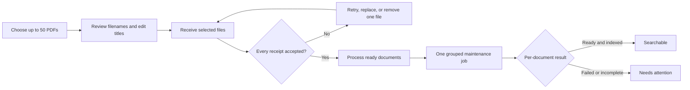

Status: Active
Audience: Operators, developers, support, release reviewers
Owner: FlowDocs maintainers
Last verified: 2026-08-04
Canonical source: docs/DOCUMENT_INTAKE_WORKBENCH.md
Supersedes: single-file upload guidance in older manuals

# Document Intake Workbench

The category workbench accepts up to 50 PDFs in one reviewed intake. Selection,
receipt, processing, and search readiness are separate states, so a browser
refresh or one rejected file does not make the whole intake ambiguous.

This workflow uses the existing `MAX_FILE_SIZE_MB` limit and maintenance worker.
It adds no deployment environment variables and does not change backup,
restore, activation, OCR, embedding, or object-store policy.

## Operator flow

1. Open the destination category and choose PDFs or drop them into the intake.
2. Review every generated title. Titles remain editable until **Receive
   Selected Files** is selected.
3. Receive the files. Each PDF gets an independent durable receipt.
4. Remove or retry rejected files. A valid receipt is not rolled back because a
   different file failed.
5. Select **Process Ready Documents**. The server seals the manifest and queues
   one grouped job; it does not create one category reindex job per browser
   request.
6. Keep or bookmark the URL while processing. The batch identifier is also
   retained in same-origin browser storage so the page can recover its status.

Drafts expire after 24 hours. Discarding a draft deletes only its unfinalized
intake rows and stored files. A finalized batch cannot be discarded.

## State and data contract

| Layer | States | Meaning |
| --- | --- | --- |
| Upload batch | `draft`, `finalized`, `discarded`, `expired` | Ownership and sealing boundary for one intake |
| Batch item | `received`, `rejected`, `removed` | Immutable receipt result for one idempotency key |
| PDF lifecycle | `intake`, `uploaded`, `processing`, `ready`, `deprecated`, `archived`, `unavailable` | Search and custody state; `intake` is never searchable |
| Processing | `queued`, `running`, `ready`, `failed` | OCR, extraction, embedding, and indexing progress |
| UI projection | Ready to upload, Received, Queued, Processing, Searchable, Needs attention | Plain-language state shown to operators |

`UploadBatch.manifest_sha256` binds the finalized batch ID, destination folder,
uploader, item idempotency keys, filenames, titles, content digests, and PDF
IDs. It is evidence for the intake job; it is not a RustFS recovery manifest.

## Validation and failure behavior

| Scenario | Result | Existing data affected? | Operator action |
| --- | --- | --- | --- |
| More than 50 selections | Extra selections are not added; server cap remains authoritative | No | Start another intake |
| File exceeds `MAX_FILE_SIZE_MB` | Rejected in the browser and by Django | No | Reduce or split the PDF according to policy |
| Extension, MIME type, or PDF signature invalid | One rejected receipt | No | Export a valid PDF and retry |
| Duplicate bytes in one batch | Later item is rejected by SHA-256 | No | Remove the duplicate receipt |
| Network interruption | Accepted receipts remain durable; the batch can be reopened | No | Refresh and reselect only files marked for retry |
| Concurrent retry | Idempotency key returns the existing receipt | No duplicate PDF | Continue from returned state |
| Queue failure during finalization | Transaction rolls back; batch remains a draft | Prior active/search data unchanged | Retry finalization after worker/queue recovery |
| Processing failure | Batch stays finalized and the affected document shows Needs attention | Other items continue | Use **Retry Processing** on that document |
| Draft expiry | Bounded cleanup removes intake-owned PDFs and marks the batch expired | No finalized or unrelated PDFs | Start a new intake |

Expected errors return bounded operator-safe messages. Responses do not include
storage paths, credentials, document text, or backend exception details.

## Document register decisions

Routine actions remain next to the document. Less common visibility and
recovery controls are inside **Actions**.

| Intent | UI choice | Stored file | Search visibility | Recovery |
| --- | --- | --- | --- | --- |
| A newer official document replaces this one | Remove from Search → newer document | Preserved | Hidden | Restore to uploaded, then process |
| Keep as a historical record | Remove from Search → historical record | Preserved | Hidden | Restore to uploaded, then process |
| Source file is genuinely unavailable | Mark unavailable with custody evidence | Record and known evidence preserved | Hidden | Exact evidence and matching media required |
| Processing failed or finished without an index | Retry Processing | Preserved | Not searchable until successful | One-document maintenance job |
| Permanent erasure | Superadmin Danger Zone | Deleted after exact confirmation | Removed | Recovery requires an external backup |

Permanent deletion is intentionally not a normal document action. It requires a
superadmin, a reason of at least 10 characters, and the exact displayed
`DELETE <id>` confirmation.

## HTTP endpoints

All mutation endpoints require authentication, an active admin/superadmin role,
same-origin CSRF protection, and `POST`.

| Route | Purpose | Idempotency/safety |
| --- | --- | --- |
| `/dashboard/folder/<id>/upload-batches/` | Create or resume the operator's active draft | Reuses the newest unexpired draft |
| `/dashboard/upload-batches/<uuid>/` | Read batch, item, and grouped-job status | Read only; owner or superadmin |
| `/dashboard/upload-batches/<uuid>/items/` | Receive one PDF | Client idempotency key, content digest, 50-file cap |
| `/dashboard/upload-batches/<uuid>/items/<id>/remove/` | Remove one draft receipt | Cannot mutate a finalized batch |
| `/dashboard/upload-batches/<uuid>/finalize/` | Seal and queue one grouped job | Repeated finalization returns the existing job |
| `/dashboard/upload-batches/<uuid>/discard/` | Discard an unfinalized batch | Deletes only batch-owned intake PDFs |
| `/pdf/<id>/remove-from-search/` | Apply a reason-based reversible visibility state | Existing lifecycle services and audit trail |
| `/pdf/<id>/retry-processing/` | Retry one incomplete document | Refuses duplicate active jobs |

## Impact analysis

| Boundary | Change | Risk control |
| --- | --- | --- |
| Database | Two new core tables and one new PDF lifecycle value | Additive migration; existing rows retain their lifecycle |
| Search | Intake PDFs are excluded until processing succeeds | `SEARCHABLE_PDF_LIFECYCLES` is unchanged |
| Storage | Draft PDFs are stored before finalization | Ownership checks and bounded expiry/discard cleanup |
| Worker | One `process_pdf` job may contain up to 50 items | Existing per-item status, retry, and job accounting |
| Browser | Vanilla JS adds concurrent receipt uploads, polling, and resume | Concurrency is fixed at 3; no new runtime configuration |
| Permissions | Permanent deletion is superadmin-only | Reversible removal is the ordinary admin path |
| Deployment | One additive migration and new static asset | Run migrations before serving the new template/image |
| Backup/recovery | No contract change | Intake tables are part of SQLite; media remains in the normal data boundary |

Rollback to an older image is safe only after confirming that the older code
tolerates the additive tables and `intake` lifecycle rows. Do not roll back
while draft/finalized intake items are awaiting processing; finish or discard
drafts first and retain the database backup used for the release.

## Verification

The release gate covers:

- service tests for permissions, duplicate content, idempotency, limits,
  transaction rollback, cleanup, finalization, and discard;
- endpoint tests for CSRF-compatible POST contracts and safe JSON;
- lifecycle/filter/retry/delete permission tests;
- desktop and mobile Playwright receipt/discard behavior;
- serious/critical axe violations and horizontal overflow; and
- Django checks, migration drift, JavaScript parsing, and graph impact review.

This workbench does not prove OCR quality, embedding-provider availability,
stage backup/restore, or production data migration. Those remain separate
release and operations gates.
