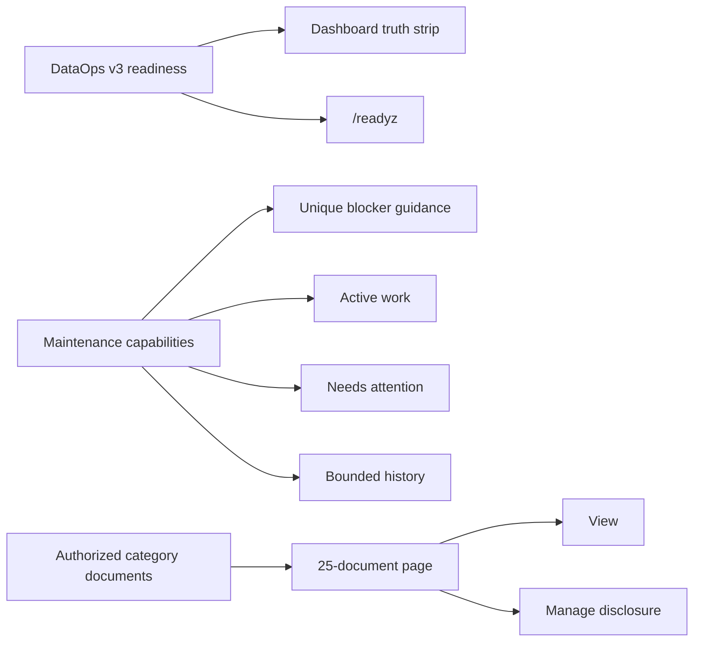

# Legacy state versus current 2026 state

This document is the short comparison for operators who need to understand
what changed. It is intentionally maintained alongside
STATUS-2026-08-03.md. The status page carries exact evidence; this page
explains the transition.

## At a glance

| Dimension | Legacy / before rehearsal | Current 2026 state |
| --- | --- | --- |
| Authority | www.ai-sahakar.net production | legacy remains authoritative; stage is rehearsal |
| Source volume | prod_flowdocs at /app/flowdocs | preserved read-only; stage also sees /mnt/legacy:ro |
| Dataset identity | legacy production namespace | ai-sahakar-prod-v2 source and ai-sahakar-stage-2026 destination |
| Storage model | live mutable volume plus historical vault evidence | immutable RustFS generations plus isolated local quarantine/runtime targets |
| Backup shape | local/legacy snapshots and prior vault material | manifest + SQLite + PDFs/media + derived indexes/cache as content-addressed objects |
| Cross-dataset copy | ordinary transfers correctly rejected | explicit clone/rebind with confirmation, collision checks, digest verification, and lineage |
| Search extraction | native PDF extraction only for many documents | native extraction first; bounded local Tesseract OCR for blank/scanned pages |
| OCR languages | not consistently available in the old path | English + Marathi + Hindi, eng+mar+hin |
| Index readiness metric | folder-index count could under-report document readiness | document-scoped searchable-PDF ratio; target 1.0 |
| Runtime activation | no signed active generation in stage | signed pointer verifies and serves the 242-document v3 runtime |
| Backup profile | stage backup selector was missing in the degraded state | manual stage backup and isolated rehearsal succeeded; backup evidence is separate from web readiness |
| Stage route | earlier route returned 404 | HTTPS, signed runtime readiness, and real English/Marathi search work |
| Image identity | mutable or older deployment references without evidence | stage intentionally tracks `:latest` and records the resolved digest; production requires an immutable digest |
| Security release | cryptography 45.0.7 findings | runtime dependency is 48.0.1; final image still passes Trivy/release certification |
| Public authentication | production accounts requested for stage | exception explicitly approved for stage; unrelated external effects stay sandboxed |
| Dashboard readiness | legacy Vault projection could disagree with `/readyz` | Dashboard and `/readyz` use the same bounded DataOps v3 runtime authority |
| Search maintenance UI | repeated blockers, malformed checkboxes, and every job/category shown at once | unique blockers, 46+ category filtering, valid controls, and active/attention/history lanes |
| PDF workbench | six-column 720px table and six or more visible actions per document | 25-document pages, responsive records, one View action, and an explicit Manage disclosure |

## Data and recovery comparison

### Before

The live production volume was the source of truth. A restore target could be
mistaken for an active target if operators relied on a container health check,
an HTTP 200, or a volume name without recording its identity. RustFS data,
application data, indexes, and control evidence were easy to confuse.

### Now

The migration has separate custody boundaries:

    Legacy production
      prod_flowdocs (read-only source)
        -> stable snapshot and source manifest
    RustFS source
      ai-sahakar-prod-v2
        -> immutable generation legacy-20260802T085639Z-86288855
    RustFS stage
      ai-sahakar-stage-2026
        -> clone-legacy-20260802T085639Z-86288855
    Stage local custody
      restore-quarantine/
        -> 242 PDFs ready and indexed
      runtime-generations/
        -> signed active generation for manifest 80d8dc81…3c96

The signed control pointer—not quarantine presence or container health—is the
active runtime authority.

## Search and OCR comparison

Before accepting a restored document, native extraction was assumed to be
enough. Scanned PDFs could appear present while lacking searchable text.

The current flow is:

1. extract native text;
2. detect pages without usable text;
3. render only those pages within pixel/page/time limits;
4. run local Tesseract with English, Marathi, and Hindi packs;
5. record OCR provenance and extracted text;
6. chunk and embed using the existing configured workflow;
7. build/update FAISS and require document readiness;
8. fail closed if any step is unsafe, incomplete, or unverifiable.

The original PDFs remain the source artifacts. OCR output, chunks, embeddings,
and FAISS indexes are derived and reproducible state.

## Backup comparison: why the new generation is larger

The new generation is a recovery set, not just a database dump. It includes:

- SQLite database;
- 242 original PDFs/media artifacts;
- FAISS and optional Chroma derived artifacts;
- PDF cache/index metadata where present;
- a manifest containing counts, schema, hashes, and lineage.

The verified stage clone is 416 objects and 1,093,501,777 bytes. A first
generation is expected to be larger than SQLite because it preserves the
documents and search artifacts needed for a usable restore. Later generations
can deduplicate identical content-addressed objects, but they must still
publish a complete manifest and verify every referenced object.

## Runtime comparison

| Check | Unsafe interpretation | Current required interpretation |
| --- | --- | --- |
| Root route 200 | application is ready | only proxy/web reachability |
| Container healthy | data is restored | process health only |
| Quarantine files exist | stage is active | restore evidence only |
| Profile is configured | backup succeeded | destination selected; receipt still required |
| Pointer file exists | generation is trusted | verify signature, digest, and readiness |
| PDF row count | search works | verify extracted text, chunks, embeddings, and indexed state |

## Current operating sequence

The stage runtime and recovery rehearsal are already proven. Routine changes
now follow this smaller sequence:

    merge green PR
      -> publish/update the stage :latest channel
      -> Dokploy pulls and recreates web + maintenance
      -> record the resolved running digest
      -> verify /readyz and representative searches
      -> run backup/isolated restore only when recovery behavior changes

Production promotion is a separate workflow: certify and pin an immutable
digest, retain a rollback digest, and verify the same signed data/runtime
evidence before any traffic change. No production DNS or traffic change is
part of the stage workflow.

## Operator workbench decision model

The UI does not bypass capability, confirmation, idempotency, source-digest,
or superadmin checks. It projects those controls into fewer, task-oriented
decisions and keeps technical evidence available on demand.

## Living-document maintenance contract

Update this page and STATUS-2026-08-02.md together when any of these changes:

- source volume, source generation, clone generation, dataset, bucket, or
  manifest evidence;
- application image digest or release revision;
- OCR language, engine, bounds, embedding model, or index readiness rule;
- stage profile, backup receipt, runtime pointer, activation, or rollback;
- public exposure, authentication, or security-owner decision.

Every update must:

1. change Last verified to the evidence date;
2. add a dated entry to OPERATIONS_CHANGELOG-2026-08-02.md or its successor;
3. distinguish observed facts, pending gates, and proposed plans;
4. preserve previous evidence rather than rewriting it as current;
5. avoid secrets, document bodies, private credentials, and shortened digests;
6. update docs/INDEX.md if a new canonical page or diagram is introduced;
7. run the documentation contract and link/path checks before publication.

When the next dated record is created, rename this page's update trigger to
point to that successor only after the successor is committed and indexed.
