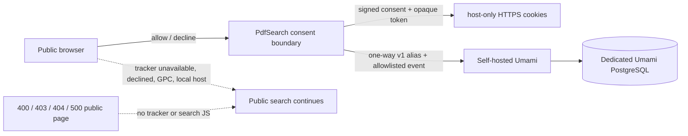

Status: Implementation candidate — application code and documentation are under review; deployment proof is still required
Audience: Superadmins, privacy owners, operators, maintainers
Owner: FlowDocs maintainers
Last verified: 2026-08-07
Canonical source: docs/PERSISTENT_ANALYTICS_OPERATIONS.md
Supersedes: The current-behaviour sections of PRODUCT_ANALYTICS_RECOMMENDATION.md and plan 032; those documents remain historical selection evidence

# Consent-led persistent analytics and public-error operations

This is the operating contract for the current PdfSearch implementation. It is
not evidence that a tracker is live on any particular host. The independent
Umami service, DNS, TLS, database retention, backup/restore, and access control
remain an operator-owned deployment and must be verified separately.

## What the application does

PdfSearch collects a deliberately small set of content-free public-search
events only after an explicit visitor choice and only on one of two exact
application hosts. It uses self-hosted Umami directly from the browser; the
PdfSearch backend neither calls Umami nor depends on it for readiness or search.

The browser receives no raw PdfSearch account identity. The analytics token is
random, not derived from the visitor, account, document, query, or answer. A
server-side HMAC turns that token into a versioned alias before an allowed
event is sent. The raw token never reaches JavaScript or Umami.

## Host and tenant boundary

| Browser host | Application collection posture | Website ID | Cookie / identity outcome |
| --- | --- | --- | --- |
| `localhost`, `127.0.0.1`, test hosts, preview hosts | Hard-disabled in code | None | No configuration, tracker, consent cookie, or identity cookie |
| `2026.ai-sahakar.net` | Stage; may be enabled by a superadmin | Built-in stage fallback or this host's saved stage ID | Stage-only cookies and alias after consent |
| `ai-sahakar.net` | Future 2026 production; allowed but requires an explicit superadmin mode and its own saved production ID | A distinct production Umami site ID; never inferred from stage | Apex-only cookies and alias after consent |
| `www.ai-sahakar.net` | Never a collection profile | None | The 2026 application redirects it to the apex before session/application code; it must not establish a parallel identity |

The stage fallback currently identifies only the stage tenant. It is public
configuration, not a secret. A production tenant ID is intentionally not baked
into the image and must never reuse the stage ID.

### Why apex and `www` are one production identity

The 2026 application canonicalizes exactly `www.ai-sahakar.net` to
`https://ai-sahakar.net` with a permanent redirect before its session and
application middleware. This gives the production application one cookie jar,
one consent record, one identity alias, and one Umami tenant.

The existing legacy `www` service is not this application. Before a 2026
production cutover, the edge proxy/DNS configuration must independently route
or redirect `www` to the apex. Application middleware is defense in depth, not
evidence that the live legacy service is already canonical.

The preferred stronger design is an edge-level permanent redirect, HTTPS on
both aliases, and HSTS after the redirect is proven. Do **not** share cookies
over `.ai-sahakar.net`: a shared Domain cookie weakens `__Host-` protections and
allows a sibling/legacy host to participate in the same browser state.

## Visitor choice and persistent state

| Item | Set when | Lifetime | Browser protection | What leaves the application |
| --- | --- | ---: | --- | --- |
| `__Host-sahakar-analytics-consent` | Visitor allows or declines optional analytics | 180 days | Secure, HttpOnly, `SameSite=Lax`, `Path=/`, host-only, signed | Never sent as analytics payload |
| `__Host-sahakar-analytics-id` | Visitor allows optional analytics and GPC is absent | 90 days | Secure, HttpOnly, `SameSite=Lax`, `Path=/`, host-only, random 256-bit value | Never; only a derived `v1_…` HMAC alias is sent |
| In-memory event queue | Before tracker becomes ready | Page lifetime; maximum 32 events | Not persisted | Only schema-valid allowed events after consent |

PdfSearch uses no `localStorage` or `sessionStorage` for this feature. The
application has no way to stop a compromised remote tracker from inspecting a
page after it is loaded, which is why the tracker origin is executable-code
trust and requires version/source review as described below.

### Privacy signals

| Signal or action | Result |
| --- | --- |
| No choice yet | No tracker is loaded and no identity token is made |
| `No thanks` / `Turn off` | Future tracker configuration is absent; the identity cookie is deleted |
| `Reset ID` | The opaque token and HMAC alias rotate; old server-side Umami events are not retroactively deleted |
| `Sec-GPC: 1` / Global Privacy Control | Always blocks collection and deletes a prior identity token; the consent record remains so the visitor can choose after disabling GPC |
| Do Not Track | Blocks collection until a visitor explicitly selects Allow analytics; explicit consent is recorded as taking precedence afterward |
| Tracker timeout/outage | The queue is dropped after bounded retries; search, source opening, language changes, and readiness are unaffected |

The direct browser connection means Umami/proxy infrastructure may see ordinary
network metadata such as IP address and user agent. The code excludes questions,
answers, documents, raw URLs, query strings, referrers, page titles, account
identity, session replay, and performance traces from authored analytics data.

## Event and transport contract

`product-analytics.js` has a closed event/property schema. Every event is
validated twice: before queueing and in the Umami `beforeSend` hook. The final
transport replaces the page path with a fixed
`/product-events/classic|workbench` path and rejects unknown properties.

Allowed public-search event families are limited to interface view/preview,
search submission/completion/retry, source opening/selection, share intent,
feedback intent, and help intent. Their properties are bounded enums such as
surface, UI language, question-language category, word-count bucket, result
outcome, reference-count bucket, and coarse latency bucket. They do not carry
free text or source data.

The tracker must be Umami **2.18 or newer** because the protection relies on
the documented [`beforeSend`](https://docs.umami.is/docs/tracker-configuration)
and [`identify`](https://docs.umami.is/docs/tracker-functions) APIs. The app
cannot safely capability-detect a remote mutable `script.js`; treat an older
or unverified tracker as a deployment failure and keep collection disabled.

## Settings & Configuration procedure

Only a superadmin can see or change the current host's collection posture. The
Settings page does not accept a tracker endpoint or credentials. The endpoint
is code-owned (`https://analytics.ai-sahakar.net/script.js`), while the public
Umami Website ID is host-scoped configuration.

1. Open **Settings & Configuration** on the exact public host.
2. Check the shown hostname, deployment tier, website-ID source, and current
   collection state. “Enabled for new page requests” is not evidence that the
   remote tracker is reachable.
3. For stage, retain the approved stage default or save a stage-specific
   replacement UUID. For production, save the separate production UUID first.
4. Select enabled, acknowledge the displayed impact, and save. The server
   rejects invalid UUIDs and will not enable a host with no effective ID.
5. Confirm the browser/network and matching Umami site record using the canary
   list below. Do not put the stage UUID into production or vice versa.
6. To stop collection, select disabled. This changes new public-page requests;
   it does not erase historical events in Umami. Use Umami's approved retention
   or deletion procedure for data already received.

No new environment variable is needed for Website IDs. This avoids a large
environment matrix and ensures a restored stage control database cannot cause
production to inherit stage collection: only the stage host may read the old
unscoped compatibility toggle, and production never reads it.

## Required independent Umami deployment proof

Before enabling a host, an operator must record secret-free evidence that:

1. Umami and PostgreSQL are a separate stack with private database networking,
   authenticated dashboard access, TLS, health checks, resource limits, log
   limits, and a tested backup/restore procedure.
2. The served script is the reviewed tracker version (at least 2.18), its image
   identity and `script.js` hash are recorded, and upgrade ownership exists.
3. Stage and production have separate Umami website records. Production accepts
   only `ai-sahakar.net`; stage accepts only `2026.ai-sahakar.net`.
4. Event/session/proxy-log retention, deletion authority, access review, and
   incident escalation are documented. PdfSearch does not enforce event
   retention.
5. CSP is tightened to the exact analytics origin before or with public
   collection. Do not attach SRI to a mutable `/script.js`; use SRI only with a
   version-stable URL and a reviewed atomic release process.

## Browser canary and rollback

Run each check in Classic and Workbench after a new image or tracker release:

| Check | Expected evidence |
| --- | --- |
| Local / preview | No `product-analytics-config`, analytics cookie, or request even if a database setting exists |
| Disabled approved host | No tracker script/config/cookie/request |
| Enabled approved host, no choice | Preference is visible; no tracker script or identity cookie |
| Explicit allow | Secure HttpOnly consent and identity cookies; a derived alias only; valid bounded events in the matching Umami tenant |
| Reload | Same alias for the current 90-day token; no raw token in DOM, storage, payload, or Umami record |
| Reset / revoke | Alias rotates / identity cookie is deleted; public search remains usable |
| GPC | No tracker/event; identity is deleted |
| Stage/production | Each reaches only its own website ID and never the other's tenant |
| Tracker unavailable | Search response and UI actions continue; analytics does not affect `/readyz` |
| 400, 403, 404, 500 | No tracker/config/search script; safe theme-consistent recovery page only |

Rollback is first a Settings change to disabled, then verification that the
script/config is absent on both public themes. The Umami stack can be restored
or stopped independently. No PdfSearch data, index, session, or runtime
generation operation is part of analytics rollback.

## Local implementation verification

On 2026-08-07, the implementation candidate passed the focused Django suite
(70 tests covering analytics, public themes, legal pages, and standard error
handlers), the six-case browser analytics adapter suite, and a five-case
Classic/Workbench 404 browser suite across four viewport sizes (20 browser
runs). The latter verifies no error-path reflection, no tracker/search client,
320px header fit, responsive width, and no serious or critical axe violations.

On this macOS workstation, Chromium headless-shell cannot launch inside the
restricted automation sandbox because macOS denies its Mach-port registration.
The same headless suites passed in the reviewed host context against an
isolated migrated database and collected static bundle. That is a local-tooling
constraint, not a deployment result; hosted CI and the production/stage canary
remain required release evidence.

## Theme-consistent public errors

The project routes Django's standard 400, 403, 404, and 500 handlers to one
public recovery renderer. It uses the same allowlisted Classic/Workbench
resolver as search and legal pages, including `?view=workbench`, but it has its
own static content and CSS:

- no authenticated admin shell, Bootstrap, search composer, search JavaScript,
  analytics configuration, or analytics script;
- no failed path or query reflected in markup, hidden fields, or return links;
- `noindex, nofollow, noarchive` metadata, keyboard skip link, a clear status,
  plain-language explanation, official-site link, return-to-search action, and
  theme-appropriate legal footer;
- static header mode: it does not resolve `request.user`, so an error page can
  still render when an authenticated session/database lookup is the failure;
- route-independent fallback: if the persisted view lookup or named-route
  resolver is impaired, the page uses script-prefixed safe return, login,
  language, and legal-link paths rather than recursing into another 500.

The renderer fails over to Classic if the persisted primary-view lookup itself
is unavailable. This is deliberately a recoverability safeguard, not a theme
setting change.

## Known limits and follow-ups

- This feature is public-search analytics only; it does not collect admin,
  intake, data-protection, or maintenance actions.
- Persistent pseudonymous identity improves returning-visitor measurement but
  is not authentication and must not be joined with account data.
- Browser and proxy metadata are governed by the Umami stack as well as the
  application; security/privacy owners must review that service independently.
- The current Settings card makes the safe state understandable, but the larger
  review/diff/receipt redesign remains planned in
  [`plans/034-settings-control-desk.md`](../plans/034-settings-control-desk.md).
- Current production remains the legacy service until an approved 2026 cutover.
  Code support for the future canonical production host is not a deployment or
  public-traffic claim.
