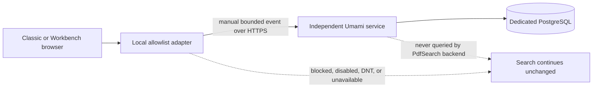

Status: Implementation candidate in PR #192; self-hosted service deployment pending
Audience: Product owner, privacy owner, developer, operator
Owner: FlowDocs maintainers
Last verified: 2026-08-07
Canonical source: docs/PRODUCT_ANALYTICS_RECOMMENDATION.md
Supersedes: None

# Privacy-first product analytics recommendation

## Decision summary

Product analytics must remain separate from operational search telemetry. Keep
search latency, provider timing, corpus state, cache behavior, and readiness in
content-free structured logs/OpenTelemetry metrics.

For an operator-custodied product-analytics pilot, choose **Umami self-hosted
in an independent stack**. Its application-plus-PostgreSQL footprint is the
smallest option that still covers the bounded page, journey, funnel, and custom
events required here. Tianji is the runner-up when its uptime/status/survey
features would replace other tools; those overlapping features are unnecessary
for the current pilot. PostHog EU Cloud Free remains a valid cloud benchmark,
not the default recommendation. Do not self-host PostHog for this application.

The operator selected self-hosted Umami and supplied the stage tracker endpoint
and browser website ID. PR #192 now contains the application-side integration,
disabled by default. The operator will deploy Umami manually as an independent
stack on the same server. Stage collection must remain disabled until that
service, its 30-day maximum pilot retention, dashboard access, backup/restore,
and deletion authority are verified. Production capture remains unapproved.

## Implemented application boundary

The integration deliberately adds no environment variables and no backend call:

- `core.product_analytics` stores one `enabled|disabled` runtime choice in the
  existing `SiteSetting` table and fails closed to disabled;
- the supplied website ID is allowed only on `2026.ai-sahakar.net`; localhost,
  the legacy production host, and future production load no tracker;
- a superadmin can change the stage mode from Settings without restart;
- `product-analytics.js` queues at most 32 in-memory events, loads the external
  script asynchronously after the usable page, and drops the queue on failure;
- the final `beforeSend` hook rejects pageviews, identity calls, unknown events,
  unknown properties, and raw browser metadata, replacing the URL with a fixed
  `/product-events/classic|workbench` path;
- Classic and Workbench emit the same bounded search/evidence event contract.

This browser sanitizer governs authored payload fields, not network metadata.
With direct browser ingestion, the self-hosted Umami server observes the request
IP address and user agent and derives a cookieless session hash from those values
plus the website ID. Umami may classify browser, operating system, device, and
country for that pseudonymous session. PdfSearch sends no account identity or
explicit stable visitor ID, but the pilot still requires approval of this
pseudonymous processing. See Umami's [session model](https://docs.umami.is/docs/sessions).

The current implementation covers public search only. Intake, maintenance, and
data-protection events remain recommendations until each workflow gets its own
payload-leakage tests. The Umami application/PostgreSQL stack, DNS, TLS, image,
database, retention, and backups remain user-managed and outside this PR.

## Category correction

The compared products do not all solve the same problem:

| Category | Candidates | Correct use here |
| --- | --- | --- |
| Product/web analytics | Umami, Tianji, Aptabase, Plausible CE, OpenPanel, Rybbit, Matomo, PostHog | Measure allowlisted, content-free user outcomes |
| Observability | Parseable, OpenTelemetry-compatible backends | Search latency, errors, traces, logs, and infrastructure health |
| Business intelligence | DataLens | Build dashboards over an existing database; it does not collect browser events |

Parseable and DataLens therefore cannot replace the selected product-analytics
collector. They may be considered later as independent operational telemetry or
BI projects, but combining them into this pilot would add services without
closing a product-measurement gap.

## Recommended self-hosted topology

If analytics data must remain under operator custody, deploy Umami v3 as an
independent Dokploy/Compose project with a pinned Umami image, a dedicated
PostgreSQL database/volume, and its own backup/restore and retention policy.
Use separate Umami website records for stage and production. Protect the
dashboard with its own authentication and expose only the documented tracker
and event-ingestion surface required by browsers.



PdfSearch must not join the analytics Docker network, mount its volumes, query
its database, or make analytics a backend/readiness dependency. The event
vocabulary and property schemas are transport-neutral; the current browser
adapter is intentionally Umami-specific. A tracker/network failure is fail-open
inside the browser. Because both stacks share one physical server, resource
exhaustion is still a shared failure domain and must be bounded operationally.

The remote tracker is executable third-party-origin JavaScript with the same
DOM access as other scripts on the public page. The payload allowlist does not
contain a compromised or unexpectedly upgraded tracker. Pin the Umami image,
record and review the served `script.js` SHA-256 before enablement and after
every upgrade, and allow only the exact analytics origin in `script-src` and
`connect-src` when the application CSP is introduced. Subresource Integrity is
recommended only after the tracker URL is made version-stable and the release
process can update the reviewed hash atomically; attaching an SRI hash to a
mutable endpoint would otherwise cause silent analytics outages after upgrade.

## Self-hosted comparison

The operational footprint below is based on each project's current official
self-hosting documentation or Compose example. "Low" still means an additional
public service, database lifecycle, security boundary, backups, upgrades,
monitoring, and incident ownership.

| Candidate | Primary capability | Current self-hosted footprint | Fit for the allowlisted journeys | Main trade-off | Verdict |
| --- | --- | --- | --- | --- | --- |
| **Umami** | Privacy-first web and product analytics, custom events, journeys, funnels | Application + PostgreSQL | High | Less experimentation/user-level depth than PostHog-class systems | **Recommended pilot** |
| **Tianji** | Website analytics plus uptime, server status, telemetry, surveys, and feeds | Application + PostgreSQL | High | Overlaps existing operational monitoring and broadens the failure/security surface | Runner-up only if its extra modules replace existing tools |
| **Aptabase** | Anonymous app-event and session analytics | Application + PostgreSQL + ClickHouse | Medium-high | ClickHouse operations; deliberately cannot provide user-level MAU/retention because it has no stable identity | Event-first alternative if anonymous session timelines become essential |
| **Plausible CE** | Privacy-focused public web traffic, goals, and custom events | Application + PostgreSQL + ClickHouse | Medium | Heavier data layer and more website/traffic-oriented than operator workflow analytics | Good public-site analytics, not first choice here |
| **OpenPanel** | PostHog-style product analytics, funnels, identity, replay, revenue | API/dashboard/workers + PostgreSQL + ClickHouse + Redis | High feature fit, low scale fit | Most relevant features exceed the approved no-identity/no-replay contract | Defer until a measured need exceeds Umami |
| **Rybbit** | Web/product analytics, funnels, goals, performance, replay | Client/backend + PostgreSQL + ClickHouse; optional proxy | Medium-high | Heavier stack; replay and self-telemetry require explicit disable/retention review | Promising richer alternative, not the low-operations choice |
| **Matomo On-Premise** | Mature broad web analytics and plugin ecosystem | PHP/web tier + database + scheduled archiving | Medium | Largest administration and plugin/security lifecycle for the small event set | Reject for this scale |
| **PostHog self-hosted** | Full product analytics platform | Multi-service stack including ClickHouse and Kafka-class components | High feature fit, very low operations fit | Officially unsupported, continuously shipped, and currently documents a 4-vCPU/16-GB baseline | Reject |
| **Parseable** | Logs, metrics, traces, APM, alerting | Single binary for small use; object storage/distributed roles at scale | Not a product-analytics replacement | Event schemas and product funnels would need to be built and governed manually | Evaluate separately for operational telemetry only |
| **DataLens** | BI datasets, SQL connectors, and dashboards | Multi-service UI/backend/auth/metadata stack over PostgreSQL/ClickHouse sources | Not an event collector | Requires a separate ingestion/data model and is much larger than the desired dashboard | Reject for collection; optional future BI layer only |

Official evidence: [Umami installation](https://docs.umami.is/docs/install),
[Tianji Compose and scope](https://github.com/msgbyte/tianji),
[Aptabase self-hosting](https://github.com/aptabase/self-hosting),
[Aptabase privacy limits](https://aptabase.com/),
[Plausible CE](https://github.com/plausible/community-edition),
[OpenPanel self-hosting](https://openpanel.dev/docs/self-hosting/self-hosting),
[Rybbit self-hosting](https://rybbit.com/docs/self-hosting),
[Matomo On-Premise](https://matomo.org/guide/installation-maintenance/matomo-on-premise-self-hosted/),
[PostHog self-hosting](https://posthog.com/docs/self-host),
[Parseable architecture](https://www.parseable.com/docs/architecture), and
[DataLens architecture](https://github.com/datalens-tech/datalens).

## Decision logic

```text
Need product journey evidence?
  no  -> keep analytics disabled
  yes -> must all event data remain operator-custodied?
           yes -> need only bounded anonymous journeys/funnels?
                    yes -> Umami
                    no  -> prove the missing capability with a two-week gap log,
                           then compare Aptabase/OpenPanel/Rybbit
           no  -> PostHog EU Cloud may be piloted after privacy approval

Need logs, traces, or latency evidence? -> OpenTelemetry backend, possibly Parseable
Need arbitrary SQL dashboards?         -> DataLens only after a governed data source exists
```

## Options

| Option | Fit | Operational/privacy cost | Recommendation |
| --- | --- | --- | --- |
| Umami self-hosted | Bounded anonymous journeys and custom events across Classic, Workbench, intake, and maintenance | Independent application/PostgreSQL operations and a new retention/backup boundary | Recommended stage pilot after privacy approval |
| PostHog EU Cloud Free | Richer funnels and bounded product events without self-hosting | Event data leaves the server; provider retention and quota limits require approval | Optional cloud benchmark |
| PostHog self-hosted | Same product surface under operator custody | PostHog documents self-hosting as unsupported; the stack is heavy relative to this application | Reject |
| Tianji self-hosted | Similar low-footprint website/custom telemetry plus monitoring and survey modules | Adds overlapping features and responsibilities beyond the pilot | Runner-up when consolidation is intentional |
| Aptabase self-hosted | Anonymous event-first app analytics | Adds PostgreSQL and ClickHouse; no stable-user analytics by design | Conditional event-timeline alternative |
| Plausible CE | Strong aggregate public-site analytics | Adds PostgreSQL and ClickHouse; admin workflow funnels are not its main strength | Secondary public-site option |
| OpenTelemetry plus existing metrics | Vendor-neutral operational latency and failure evidence | Needs a metrics/traces backend, but no product identity model | Adopt for search operations, not product analytics |

Primary references: [PostHog pricing](https://posthog.com/pricing),
[privacy](https://posthog.com/docs/privacy),
[JavaScript configuration](https://posthog.com/docs/libraries/js/config),
[self-hosting](https://posthog.com/docs/self-host),
[session-replay privacy](https://posthog.com/docs/session-replay/privacy),
[Umami documentation](https://docs.umami.is/docs),
[Plausible privacy model](https://plausible.io/privacy-focused-web-analytics),
and [OpenTelemetry metrics](https://opentelemetry.io/docs/concepts/signals/metrics/).

## Non-negotiable privacy contract

Use one internal analytics adapter that rejects unknown events and properties;
application code must not call a vendor SDK directly. The adapter must fail
open and load after the usable UI. Across every transport: manual events only,
no automatic pageviews/performance/exceptions, no replay, no application account
identity or explicit stable visitor ID, no raw URL/query string, respect Do Not
Track, and run a final payload rejection hook. Direct browser ingestion still
uses Umami's documented pseudonymous session hash; do not describe it as having
no session processing.

For Umami, configure the asynchronously loaded tracker with `data-auto-track="false"`,
`data-do-not-track="true"`, the exact allowed domain, and `data-before-send`;
emit events only through the validated adapter. See the official
[tracker configuration](https://docs.umami.is/docs/tracker-configuration) and
[manual event API](https://docs.umami.is/docs/track-events).

If PostHog EU Cloud is explicitly selected instead, map the same contract to:

```text
autocapture=false
capture_pageview=false
capture_pageleave=false
capture_performance=false
capture_exceptions=false
disable_session_recording=true
person_profiles=identified_only
cookieless_mode=always
mask_all_text=true
mask_all_element_attributes=true
```

Never call identify/alias/person-merge APIs. Never capture raw questions,
answers, prompt/context text, PDF text, titles, filenames, source URLs, route
parameters, query strings, document IDs, application user/account/session IDs,
usernames, emails, roles, explicit distinct IDs, dataset/profile/bucket/generation names,
manifest digests, credentials, auth data, or recovery identifiers. Session
replay and PostHog LLM observability remain disabled, not merely masked.

The Umami service will necessarily observe request network metadata. It must not
log, export, or retain raw IP addresses beyond what the pinned version requires
to derive its documented session hash. Proxy access logs must follow the same
30-day maximum and access controls.

The browser project token may be public; personal API keys never enter browser
code. Cookieless operation still requires an updated privacy notice and the
privacy owner's jurisdiction-specific consent decision.

## Allowed shared properties

Every event may contain only bounded enums/buckets:

| Property | Allowed values |
| --- | --- |
| `schema_version` | integer contract version |
| `deployment_tier` | `stage`, `production` |
| `surface` | `classic`, `workbench`, `admin`, `document_intake`, `data_maintenance` |
| `ui_language` | `en`, `mr` |
| `viewport_class` | `mobile`, `tablet`, `desktop` |
| `release_version` | reviewed non-secret application release identifier |

## Event allowlist

| Journey | Events | Additional bounded properties |
| --- | --- | --- |
| Public search | `search_viewed`, `search_submitted`, `search_completed`, `search_retry_clicked` | `view`, `question_language`, word/latency/reference-count bucket, `outcome`, `answer_kind`, `failure_family` |
| Evidence use | `search_sources_opened`, `search_source_selected`, `search_share_started`, `search_feedback_opened`, `search_help_opened` | source-rank/count bucket, `channel`, `answer_kind`; never source identity or content |
| Theme continuity | `search_view_override_used` | bounded `from_view`, `to_view` |
| Intake | `upload_batch_started`, `upload_batch_completed`, `document_processing_completed`, `indexing_completed` | file/size/page/document-count/duration buckets, `native_text` or `ocr_fallback`, outcome/failure family |
| Maintenance | `maintenance_preview_created`, `maintenance_action_submitted`, `maintenance_action_completed`, `maintenance_action_blocked`, `admin_guidance_opened` | bounded operation/scope/outcome/blocker/count/duration enums |
| Data protection | `data_protection_step_completed` | bounded step/outcome/duration only; no storage or recovery-point identity |

Search outcomes are strict enums: `evidence`, `no_evidence`, `conversational`,
`provider_timeout`, `provider_unavailable`, `rate_limited`, `invalid_request`,
or `internal_error`. Use duration buckets (`<1s`, `1–3s`, `3–10s`, `10–30s`,
`>=30s`) rather than high-cardinality raw values.

Capture all failures and high-value workflow outcomes during the bounded pilot.
Monitor event rate, PostgreSQL growth, free bytes/inodes, and retention-purge
lag. Alert when purge evidence is more than 24 hours old or projected storage
headroom falls below 30 days. Sampling is a later code change, not an operator
toggle; do not silently drop authored failure events.

## Release gate

Before stage capture:

1. The privacy notice and cookie policy disclose the cookieless stage pilot;
   before enabling it, the operator verifies the independent Umami retention,
   backup, restore, and deletion schedule.
2. Unit tests reject every forbidden property and unknown event. **Implemented
   for the public-search adapter in PR #192.**
3. Browser tests inspect emitted payloads for both themes and future admin journeys;
   sentinel questions, answers, filenames, URLs, and identities must be absent.
   **Adapter-level payload rejection is implemented in PR #192.**
4. Analytics blocked/unreachable tests prove no UI or backend failure, delay,
   retry, or readiness degradation. **Adapter-level fail-open behavior is
   implemented; both enabled themes still require the operator outage rehearsal
   against the deployed service.**
5. Stage uses one project with a bounded `deployment_tier`; production capture
   remains disabled until the two-week evidence review.
6. Privacy approval explicitly covers Umami's IP/user-agent-derived pseudonymous
   session hash, device/browser/OS/country classification, and proxy metadata.
7. Security approval records the pinned Umami image digest, served tracker
   SHA-256, exact CSP origins, upgrade owner, and emergency disable procedure;
   a remote-script compromise is treated as a public-page security incident.

Do not use feature flags for authentication, authorization, source selection,
indexing, backup, restore, activation, or other safety-critical behavior.
