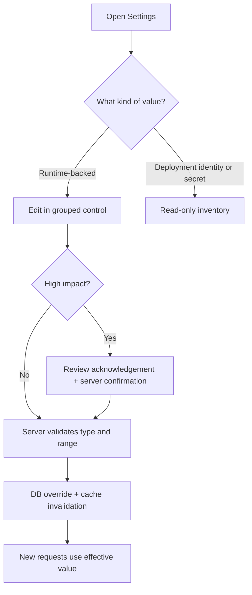

Status: Active
Audience: Superadmins, operators, maintainers
Owner: FlowDocs maintainers
Last verified: 2026-08-07
Canonical source: docs/SETTINGS_OPERATIONS.md
Supersedes: None

# Settings & Configuration operations

The superadmin Settings page is a safety boundary, not a replacement for deployment configuration. It separates values that the running request path can read immediately from environment-owned identity, data lineage, credentials, and process topology.

## Decision model

## Controls

| Group | Setting | What it controls | Validation / safety | Takes effect |
| --- | --- | --- | --- | --- |
| Public search | `PUBLIC_SEARCH_ENABLED` | Whether unauthenticated visitors may search and open public source PDFs | `Enabled`/`Disabled`; explicit confirmation required | New requests |
| Public search | `DISPLAY_SERVICE_FOOTER` | Public attribution and policy footer | `Visible`/`Hidden` | New page requests |
| Search limits | `PUBLIC_SEARCH_MAX_WORDS` | Maximum question size before search work starts | Integer `1–100` | New search requests |
| Search limits | `PUBLIC_SEARCH_RATE_LIMIT` | Requests per visitor per rate window | Integer `1–600` | New search requests |
| Search limits | `PUBLIC_SEARCH_RATE_WINDOW` | Rate-window duration | Integer `10–86400` seconds | New search requests |

The effective value shows its source: database override, environment, or application default. A database override is intentionally visible so an operator can tell why the running behavior differs from the deployment file.

## Consent-led analytics control

The **Product analytics** card is deliberately narrower than the configuration
inventory. It displays the exact host, deployment tier, collection mode, and
Website-ID source before a superadmin can change anything:

| Host | Website-ID rule | Enablement rule |
| --- | --- | --- |
| `2026.ai-sahakar.net` | Approved built-in stage ID or a saved stage-specific ID | Superadmin may enable/disable for new page requests |
| `ai-sahakar.net` | A separately saved production UUID is required; stage is never inherited | Superadmin may enable/disable only after that ID is valid |
| Local, preview, test, `www` | No profile and no editable control | Hard-disabled; no tracker configuration can be saved or emitted |

The Website ID is a public Umami site identifier, not a credential. The tracker
endpoint, access keys, database, retention, and DNS remain deployment-owned
and are intentionally not editable from the web UI. A saved enabled state means
only that future public page responses may offer collection after visitor
consent; it does not prove the remote script, tenant, or event ingestion is
live. Confirm those separately with the browser canary procedure in
[PERSISTENT_ANALYTICS_OPERATIONS.md](PERSISTENT_ANALYTICS_OPERATIONS.md).

Disabling collection removes configuration from new public page responses. It
does not delete Umami data already retained by the independent service.

## What stays read-only

`DATA_MODE`, `RESTORE_SOURCE_DATASET_ID`, `DATASET_ID`, `AUTHORITATIVE_DATASET_ID`, backup role/sync posture, image identity, release identity, S3/RustFS endpoint and credential state remain in the configuration inventory. They define data lineage, trust boundaries, or process startup posture; changing a database row cannot safely reconfigure an already-running process. Change them through the reviewed deployment workflow and verify `/readyz` afterward.

Secrets are represented only as `Configured` / `Not configured`. The page never displays values, prefixes, or generated credentials.

## Operator procedure

1. Read the Environment Identity and Data Recovery sections before changing a control.
2. Use the preview/public search link to confirm which surface is affected.
3. Change one logical group at a time; keep the review acknowledgement selected only after checking the displayed values.
4. Treat disabling public search as an incident-control action: confirm the reason and communicate the expected user impact.
5. Re-test a public query and `/readyz` after a high-impact change. If behavior is not correct, revert the setting or remove the database override through the normal reviewed operation.

## Failure behavior

Invalid choices, empty values, non-integers, and out-of-range numbers are rejected without writing any setting. High-impact changes without the explicit confirmation field are rejected. A failed save leaves the previous effective value and cache untouched.

The page is available to superadmins only. `SETTINGS_EDIT_ENABLED=0` keeps the control center in read-only mode even for a superadmin; this is the default posture for production unless the deployment owner has intentionally enabled runtime overrides.
