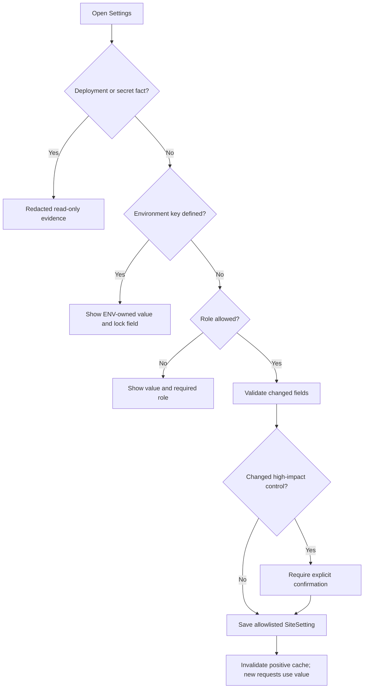

Status: Active
Audience: Superadmins, operators, maintainers
Owner: FlowDocs maintainers
Last verified: 2026-08-08
Canonical source: docs/SETTINGS_OPERATIONS.md
Supersedes: None

# Settings & Configuration operations

The Settings page is a role-aware safety boundary, not a replacement for
deployment configuration. Superadmins can manage the complete allowlisted
runtime surface. Administrators can inspect the same redacted operating record
and change only harmless presentation and question-length controls.

The effective-value precedence is always:

```text
explicit environment value > saved SiteSetting override > application default
```

An omitted runtime key remains UI-editable. Defining that key in the process
environment makes it deployment-owned and read-only in the UI. Empty or invalid
security-sensitive analytics environment values fail closed instead of falling
back to a saved value.

## Decision model



## Controls

| Group | Setting | What it controls | Validation / safety | Takes effect |
| --- | --- | --- | --- | --- |
| Public search | `PUBLIC_SEARCH_ENABLED` | Whether unauthenticated visitors may search and open public source PDFs | `Enabled`/`Disabled`; explicit confirmation required | New requests |
| Public search | `DISPLAY_SERVICE_FOOTER` | Public attribution and policy footer | `Visible`/`Hidden` | New page requests |
| Public search | `PUBLIC_SEARCH_PRIMARY_VIEW` | Primary public presentation when no request preview is present | `classic`, `workbench`, or `maharashtra`; invalid values fail closed to Classic | New page requests |
| Search limits | `PUBLIC_SEARCH_MAX_WORDS` | Maximum question size before search work starts | Integer `1–100` | New search requests |
| Search limits | `PUBLIC_SEARCH_RATE_LIMIT` | Requests per visitor per rate window | Integer `1–600` | New search requests |
| Search limits | `PUBLIC_SEARCH_RATE_WINDOW` | Rate-window duration | Integer `10–86400` seconds | New search requests |

| Control | Administrator | Superadmin |
| --- | --- | --- |
| View environment, recovery evidence, and redacted inventory | View | View |
| Service footer | Edit when not ENV-owned | Edit when not ENV-owned |
| Maximum question words | Edit when not ENV-owned | Edit when not ENV-owned |
| Primary Classic/Workbench/Maharashtra Service view | Edit when not ENV-owned | Edit when not ENV-owned |
| Public-search enablement and rate controls | View | Edit when not ENV-owned |
| Host analytics mode and public Website ID | View | Edit when not ENV-owned |

The effective value shows its source as `environment override`, `saved
override`, or `application default`. A saved override is intentionally visible
so an operator can explain behavior without reading the control database.

`PUBLIC_SEARCH_PRIMARY_VIEW` is the existing optional deployment override; the
third theme adds the allowlisted value `maharashtra`, not a new environment
variable. When the key is absent, an authorized operator may save the selection.
When the key is defined, Settings displays the effective theme as ENV-owned and
read-only. Request-only previews remain available at `/?view=classic`,
`/?view=workbench`, and `/?view=maharashtra` and never change the saved value.

## Consent-led analytics control

The **Product analytics** card is deliberately narrower than the configuration
inventory. It displays the exact host, deployment tier, collection mode, and
Website-ID source before a superadmin can change anything:

| Host | Website-ID rule | Enablement rule |
| --- | --- | --- |
| `2026.ai-sahakar.net` | Approved built-in stage ID or a saved stage-specific ID | Superadmin may enable/disable for new page requests |
| `ai-sahakar.net` | A separate production UUID is required; stage is never inherited | Superadmin may enable/disable only after that ID is valid |
| `www.ai-sahakar.net` | Redirects to the canonical apex before application state | No parallel tenant, consent, or identity |
| Local, preview, test | No profile and no editable control | Hard-disabled; no tracker configuration can be saved or emitted |

The Website ID is a public Umami site identifier, not a credential. The tracker
endpoint, access keys, database, retention, and DNS remain deployment-owned
and are intentionally not editable from the web UI. A saved enabled state means
only that future public page responses may offer collection after visitor
consent; it does not prove the remote script, tenant, or event ingestion is
live. Confirm those separately with the browser canary procedure in
[PERSISTENT_ANALYTICS_OPERATIONS.md](PERSISTENT_ANALYTICS_OPERATIONS.md).

Disabling collection removes configuration from new public page responses. It
does not delete Umami data already retained by the independent service.

`PRODUCT_ANALYTICS_MODE` and `PRODUCT_ANALYTICS_WEBSITE_ID` are optional
deployment overrides. If either is explicitly defined, its corresponding UI
control is locked and the environment value wins. The Website ID is public
configuration, but it is still host-specific and is never copied between stage
and production.

## What stays read-only

`DATA_MODE`, `RESTORE_SOURCE_DATASET_ID`, `DATASET_ID`, `AUTHORITATIVE_DATASET_ID`, backup role/sync posture, image identity, release identity, S3/RustFS endpoint and credential state remain in the configuration inventory. They define data lineage, trust boundaries, or process startup posture; changing a database row cannot safely reconfigure an already-running process. Change them through the reviewed deployment workflow and verify `/readyz` afterward.

Secrets are represented only as `Configured` / `Not configured`. The page never displays values, prefixes, or generated credentials.

## Operator procedure

1. Read the Environment Identity and Data Recovery sections before changing a control.
2. Use the matching request-only preview link to confirm the complete theme,
   legal-page shell, language switch, service links, long-answer behavior, and
   source presentation before changing the primary selection.
3. Change one logical group at a time; keep the review acknowledgement selected only after checking the displayed values.
4. Treat disabling public search as an incident-control action: confirm the reason and communicate the expected user impact.
5. Re-test a public query and `/readyz` after a high-impact change. If behavior
   is not correct, restore Classic as the saved primary (or correct the
   deployment-owned existing key) and verify the previous presentation. Theme
   rollback does not change documents, indexes, recovery points, or runtime
   generations.

## Failure behavior

Invalid choices, empty values, non-integers, and out-of-range numbers are rejected without writing any setting. High-impact changes without the explicit confirmation field are rejected. A failed save leaves the previous effective value and cache untouched.

The page is available to administrators and superadmins. Authorization is
enforced per setting on the server; hiding or disabling a browser control is
not the security boundary. Deployment identity, credentials, recovery posture,
and unknown settings remain read-only. No global edit-enable environment flag
exists: ownership is expressed by defining only the specific keys that must be
deployment-controlled.
