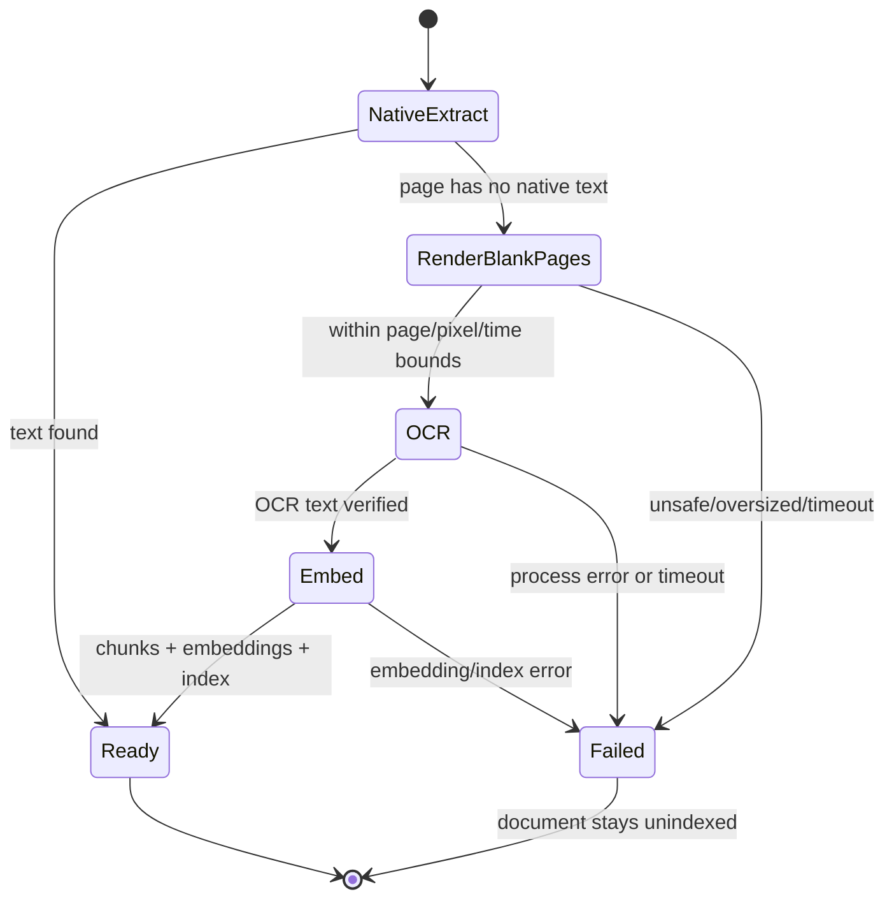
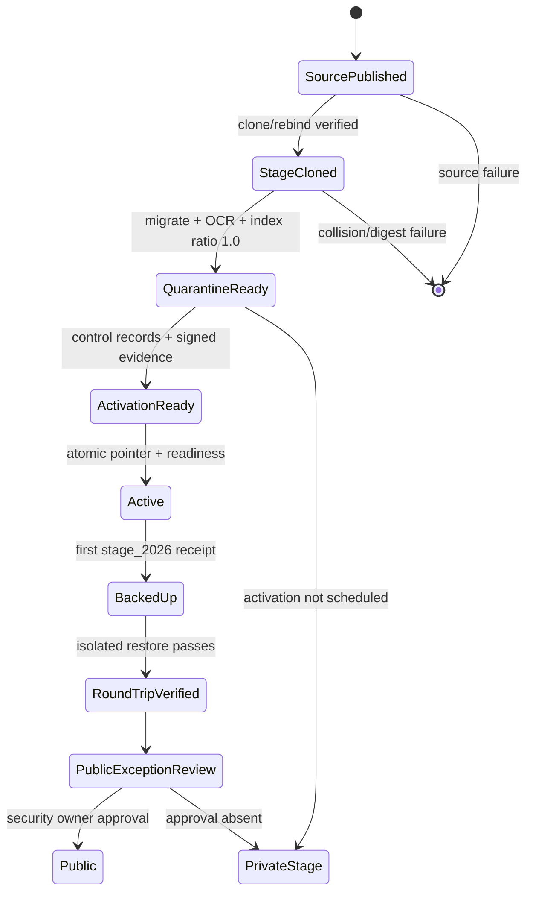

# Legacy production data → RustFS v2 → 2026 stage

> Historical snapshot: use [HANDOFF.md](HANDOFF.md) for current state. This
> page preserves the migration evidence and decisions recorded on 2026-08-02.

This is the dated operational record for the data migration and stage recovery
rehearsal. It is separate from design documents: those pages explain the
contracts, while this page preserves what had happened, what was verified, and
what remained blocked on 2026-08-02.

> **Current verdict (2026-08-02):** the legacy snapshot was published into a
> new immutable RustFS v2 lineage, cloned into the stage dataset, restored into
> quarantine, migrated, OCR-processed, and made fully searchable. The running
> 2026 stage has not yet activated that generation and has not published its
> first stage backup. The public authentication exception remains blocked.

## Scope and non-goals

The authoritative legacy site remains www.ai-sahakar.net and was not changed.
No production DNS, traffic, volume, RustFS pointer, or production application
was cut over. The 2026 deployment is a non-production rehearsal target whose
HTTPS route is reachable; route reachability does not approve public
authentication or administrator exposure.

The request to preserve production authentication byte-for-byte and expose the
full login/admin surface indefinitely is a security exception. It is not
enabled by this run. Private technical validation may continue; public
exposure requires a named security owner, monitoring, incident response,
rollback authority, and explicit approval.

## End-to-end picture

```mermaid
flowchart LR
  L["Legacy production\nwww.ai-sahakar.net\nprod_flowdocs (read-only)"]
  I["Stable snapshot\nSQLite backup + hashes\nPDF/media + FAISS/Chroma/cache"]
  V["RustFS v2 source vault\nai-sahakar-prod-flowdocs-artifact-vault-v2\nDataset: ai-sahakar-prod-v2"]
  C["Advanced clone/rebind\nexplicit source generation\ncollision + digest checks"]
  S["RustFS stage vault\nai-sahakar-stage-2026-flowdocs-artifact-vault\nDataset: ai-sahakar-stage-2026"]
  Q["Stage quarantine\nmigrations + OCR + embeddings\n242/242 ready and indexed"]
  A["Signed atomic activation\nruntime-generations + pointer"]
  B["First stage backup\nstage_2026 profile"]
  R["Disposable round-trip restore\nseparate data/control volumes"]
  G["Public exposure gate\nsecurity-owner approval only"]

  L --> I --> V --> C --> S --> Q --> A --> B --> R
  A -. "private validation only" .-> G
  G -. "blocked pending approval" .-> L
```

The dashed branch is deliberately not part of the technical activation path.
The legacy site remains authoritative throughout.

## Boundary inventory

| Boundary | Verified identity / value | Treatment |
| --- | --- | --- |
| Legacy service | sahakar-dev-frontend-dockerfile-1cubi5 | unchanged |
| Legacy volume | prod_flowdocs, mounted at /app/flowdocs | source, read-only |
| Legacy database | SQLite, approximately 282 MiB | integrity and foreign-key checks passed |
| Legacy inventory | 242 PDFs, 46 folders, 7 users, 29 migrations | recorded without document contents |
| Stage deployment | sahakar-ai-sahakar-frontend-2026-prod-ruhj6z | existing named volumes retained |
| Stage data volume | sahakar-ai-sahakar-frontend-2026-prod-ruhj6z_flowdocs_data | active target boundary |
| Stage control volume | sahakar-ai-sahakar-frontend-2026-prod-ruhj6z_flowdocs_control | signed evidence/pointer boundary |
| Legacy mount in stage | prod_flowdocs at /mnt/legacy:ro | evidence only; never active target |
| Stage route | https://2026.ai-sahakar.net | route is live; /readyz is 503 until activation/backup |
| Stage image currently running | ghcr.io/nimble-esolutions/pdfsearch/shakar-frontend@sha256:b71de1e5c89b81b303737a58e86f83d4c655688a9a4a5c97308b18a687ee2caa | PR #167 revision |
| Current image revision | fcd277c234a9634afad9581169d03e89669db13b | immutable runtime identity |

### The 404/503 distinction

The earlier https://2026.ai-sahakar.net/ 404 report was a routing/deployment
problem. The route is now served by the stage web container. A later
/readyz response is intentionally 503 with status=not_ready because no signed
active generation and no stage recovery-point receipt exist yet. A root HTTP
success is not readiness proof.

## RustFS lineage

Two buckets and two datasets are intentionally separate:

| Profile | Bucket | Dataset | Role | Purpose |
| --- | --- | --- | --- | --- |
| production_v2_source / production source | ai-sahakar-prod-flowdocs-artifact-vault-v2 | ai-sahakar-prod-v2 | restore | immutable legacy-production source |
| stage_2026 | ai-sahakar-stage-2026-flowdocs-artifact-vault | ai-sahakar-stage-2026 | both | stage-owned restore points and backups |

The historical production bucket is not the v2 source and was not modified.
Root RustFS credentials were not passed to the application. The application
uses the existing secret-provider credential reference, with non-secret
profile identity and role values in the stage environment.

### Published source generation

The verified source generation is:

    legacy-20260802T085639Z-86288855

The source manifest and recovery evidence contain the full canonical digest;
operators must copy the digest from the receipt/evidence file rather than
retyping a shortened value into a command. The source generation is immutable.

### Clone/rebind result

The explicit clone operation created:

    clone-legacy-20260802T085639Z-86288855

Verified destination object set:

    objects: 416
    bytes:   1,093,501,777

Clone/rebind preserved source immutability, rewrote dataset-bound keys and
manifest references, and recorded parent lineage:

    {
      "parent_dataset_id": "ai-sahakar-prod-v2",
      "parent_generation_id": "legacy-20260802T085639Z-86288855",
      "parent_manifest_sha256": "<full digest in receipt>",
      "clone_reason": "stage-rehearsal"
    }

The full digest is intentionally represented as a placeholder in examples.
Never put document bodies, credentials, or copied production data in tickets,
Git, screenshots, or this document.

## Restore and indexing evidence

The cloned generation was restored to the stage quarantine workspace:

    /app/data/restore-quarantine/clone-legacy-20260802T085639Z-86288855/
      restore-clone-legacy-20260802T085639Z-86288855/

The restore receipt recorded a canonical Data Operations manifest digest. The
raw manifest-file SHA and the canonical Data Operations digest are different
representations; compare like with like using the application's canonical
manifest-digest helper.

Migration and reconciliation evidence:

- database integrity passed;
- foreign-key validation passed;
- migrations were applied through 0027_pdffile_processing_evidence;
- 242 PDF rows were present;
- 46 folders and 7 users were preserved;
- 45 folder FAISS indexes were rebuilt from stored embeddings;
- seven uppercase .PDF suffixes were included by case-insensitive inventory;
- nine PDFs initially lacked searchable chunks and were processed through the
  bounded OCR/embedding path;
- the final quarantine check found no missing or not-ready PDFs;
- all 242 PDFs were processing_status=ready, had extracted text, page chunks,
  embeddings, and indexed=True;
- the document-scoped indexing ratio is expected to be 1.0 after PR #168,
  rather than incorrectly comparing folder-index count with document count.

One representative scanned-document result (ID 63) had no native text and was
processed with eng+mar+hin Tesseract OCR across 21 pages. OCR is local and
bounded; extracted text may then reach the existing embedding provider under
the configured external-side-effect policy. Original PDFs remain in custody.

### OCR lifecycle

Native extraction remains first. OCR is a fallback for pages without usable
native text, not a replacement for the original PDF and not a reason to accept
partial indexing.

## Stage environment posture

The following non-secret values are the current stage contract:

    APP_ENV=staging
    DATA_MODE=empty
    DATA_BOOTSTRAP_MODE=empty
    DATASET_ID=ai-sahakar-stage-2026
    AUTHORITATIVE_DATASET_ID=ai-sahakar-stage-2026
    DATAOPS_ENABLED=1
    DATAOPS_ENV_PROFILES=production_v2_source,stage_2026
    DATAOPS_RESTORE_PROFILE=stage_2026
    DATAOPS_BACKUP_PROFILE=stage_2026
    BACKUP_ROLE=reader
    BACKUP_SYNC_MODE=manual
    STAGING_INITIAL_ACTIVATION_ENABLED=0
    STAGING_RUNTIME_ACTIVATION_ENABLED=0
    EXTERNAL_SIDE_EFFECTS_MODE=sandbox
    PUBLIC_SEARCH_ENABLED=1

Actual credential, signing-key, recovery-password, API-key, and secret-key
values are held by the secret provider and must never be copied into examples.
The stage env file is mode 0600 and has a timestamped pre-normalization
backup.

The generic compatibility identity was corrected to the currently running
immutable stage image and the v2 production source namespace. Environment
changes require a controlled Compose recreate; editing an env file alone does
not change already running processes. PUBLIC_SEARCH_ENABLED is not the public
authentication exception: it controls anonymous search behavior, while
production-derived accounts and the full login/admin surface remain gated.

### Compose project-name warning

The Dokploy Compose project name is part of the storage boundary. Running
Compose from the timestamped backup directory without the original project
name created temporary blank volumes and failed on a static-files path. Those
exact temporary containers, networks, and volumes were removed. The original
stage containers and named data/control volumes were then recreated with:

    docker compose \
      --project-name sahakar-ai-sahakar-frontend-2026-prod-ruhj6z \
      --env-file /root/stage-2026.env \
      -f /root/backups/<stage-project>/<preserved-release>/docker-compose.yml \
      up -d --no-build

Never use down -v against the active project. Never omit the project-name
override when operating from a preserved Dokploy Compose directory.

## Exact current state machine

Current state is QuarantineReady. The running stage is deliberately not
Active: the quarantine workspace is not the runtime pointer.

## Remaining execution checklist

### Security release

- [x] Upgrade cryptography constraint and lock entry to 48.0.1.
- [x] Open PR #169 against dev.
- [x] PR contract, source/deployment contract, and pre-merge certification
  passed.
- [ ] Merge through the required reviewer workflow.
- [ ] Build the immutable dev candidate.
- [ ] Rerun Trivy on the pushed digest and record the result.
- [ ] Deploy only the certified digest to stage, retaining the current b71
  digest as rollback reference.

The PR build intentionally skips the candidate/Trivy job on pull requests.
Trivy's previous HIGH finding was cryptography 45.0.7: the CVE fix begins at
46.0.5, while the GHSA fix requires 48.0.1. The runtime already removes
builder-only setuptools and wheel; remaining findings after the new scan must
be assessed against the base image or updated dependencies.

### Signed activation

- [ ] Create/verify the stage profile registration in the control database.
- [ ] Register the restored generation and activation-ready workspace.
- [ ] Write exact generation and canonical manifest digest into signed evidence.
- [ ] Schedule activation with explicit confirmation and idempotency key.
- [ ] Verify the atomic pointer and runtime evidence.
- [ ] Verify /readyz reports signed generation, exact digest, configured
  restore/backup profiles, and indexing ratio 1.0.

Failure must leave the previous pointer and prior active generation unchanged.

### First stage backup

- [ ] Publish the active stage generation to stage_2026.
- [ ] Verify receipt, source/destination profile fields, object count, and
  canonical manifest digest.
- [ ] Enable automatic backup only after the first manual publication succeeds.

### Isolated round trip

- [ ] Create separate disposable data and control volumes.
- [ ] Restore the selected stage recovery point there; never target active
  stage volumes.
- [ ] Verify checksums, SQLite integrity, migrations, PDF/media counts, OCR
  evidence, indexing, and representative English/Marathi search.
- [ ] Compare backup and isolated-restore manifests, lineage, and digest
  evidence.
- [ ] Retain failed targets for investigation; clean successful disposable
  targets only after evidence review.

## Operator command examples

The following examples use placeholders. They are run only after the relevant
approval and with secrets supplied by the secret provider.

### Read-only stage evidence

    ssh root@80.65.208.138 '
      docker ps --format "{{.Names}} {{.Status}}"
      curl -skS -i https://2026.ai-sahakar.net/readyz
    '

Interpret 200 from the root route separately from /readyz. Readiness must show
a signed generation and backup evidence, not merely a healthy container.

### Verify a pinned generation

    docker compose exec -T --user appuser web \
      python manage.py verify_activation_runtime \
      --generation-id "<exact-generation-id>"

### Verify a release

    IMAGE="ghcr.io/nimble-esolutions/pdfsearch/shakar-frontend@sha256:<digest>"
    docker pull "$IMAGE"
    docker image inspect "$IMAGE" \
      --format '{{index .Config.Labels "org.opencontainers.image.revision"}}'

Never replace <digest> with latest, dev, or a local tag.

## Evidence and audit rules

Record command, timestamp, operator/agent, host/service, image digest,
generation ID, manifest digest, volume identity, result, and rollback reference.
Do not record access keys, secret keys, signing keys, passwords, API keys,
document names, document text, or document contents. The durable AI audit
ledger contains the current dependency remediation and stage env-normalization
entries; link those entries from release records rather than duplicating
secrets.

## Rollback

Application rollback and data rollback are separate:

1. preserve the current signed pointer and evidence;
2. pin the previously certified image digest;
3. restore the previous runtime pointer atomically if activation verification
   fails;
4. never overwrite the active data volume with a quarantine copy;
5. if backup publication fails, leave the active generation and pointer
   unchanged and investigate the receipt/object set.

The legacy production site remains the final authoritative rollback reference
for this rehearsal, but it is not an active stage target.
