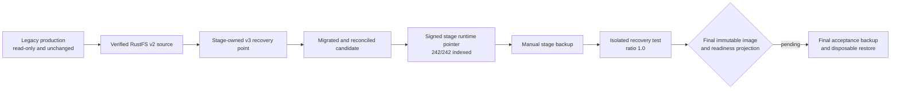

Status: Active
Audience: Operator, Developer, Reviewer
Owner: FlowDocs maintainers
Last verified: 2026-08-03
Canonical source: docs/STATUS-2026-08-03.md
Supersedes: docs/STATUS-2026-08-02.md for current operational state

# Operational status — 2026-08-03

This is the current secret-free handoff for the legacy-production to 2026-stage
recovery rehearsal. The 2026-08-02 record remains immutable historical context.

## Outcome so far

| Gate | Current evidence | Status |
| --- | --- | --- |
| Legacy source | `prod_flowdocs` remains mounted read-only; production route and traffic were not changed | Passed |
| Stage import | Recovery point `import-legacy-20260802-86288855-stage-2026`, manifest `80d8dc81…3c96` | Passed |
| Signed activation | Control pointer signature verifies for generation `dataops-import-legacy-20260802-86288855-stage-2026` | Passed |
| Active stage data | 242 documents, 242 indexed, 46 folders, 7 users | Passed |
| Search provider | AI-only mode enabled; unrelated external effects remain sandboxed | Passed |
| Search smoke | English: 2 references; Marathi: 3 references; no sandbox response | Passed |
| Local v3 recovery | Fresh control discovery and separate-volume restore of all 242 documents | Passed |
| Real stage backup | Two manual stage points published; physical object reuse observed | Provisional |
| Real stage recovery test | Isolated rehearsal succeeded with indexing ratio 1.0 | Provisional |
| Final release/readiness | PR 176 image not yet deployed; old readiness code omits active v3 evidence | Pending |

“Provisional” means the mechanism ran successfully on real stage storage, but
the acceptance run must be repeated from the final immutable PR image.



## Exact activation evidence

- Candidate state: `activated` at 2026-08-03 03:45 UTC.
- Signed runtime pointer:
  `/app/data-control/runtime/active.json`.
- Runtime generation:
  `dataops-import-legacy-20260802-86288855-stage-2026`.
- Manifest SHA-256:
  `80d8dc81d27956d86054953d1651ff5a88e1597449fc73c34f82a351c1a83c96`.
- Runtime database:
  `/app/data/runtime-generations/dataops-import-legacy-20260802-86288855-stage-2026-80d8dc81d279/db.sqlite3`.
- Database size: 585,900,032 bytes.

The signed control pointer is authoritative. The older deployed readiness code
currently returns no active generation even though it resolves and serves the
signed runtime. PR 176 binds readiness to this v3 evidence; acceptance waits for
that exact immutable image and a post-deploy `/readyz` proof.

## Backup and recovery evidence

### Local final-branch round trip

- Recovery point: `local-a6-current-v3b-8040280`.
- Manifest:
  `5e459ff8e58a230d4d703b4c4672229fc656f266e9801f0316bd9641ecc8fddd`.
- Complete logical set: 416 objects / 1,383,414,609 bytes.
- Physical transfer: 0 uploads; all 416 objects reused by digest.
- Fresh-control discovery operation restored into separate disposable data and
  control volumes.
- Result: 242 database rows, 242 PDFs, 45 FAISS files, 7,615 vectors at
  dimension 1,536, SQLite integrity and foreign keys valid, indexing ratio 1.0.

An absent Chroma tree is now represented as a signed coherent empty optional
component. A present Chroma tree remains fail-closed unless its compatibility
is proven; omitted files cannot be mislabeled as empty.

### Real stage proof before final release

| Operation | Manifest | Physical transfer | Result |
| --- | --- | --- | --- |
| `60219667…` backup | `1b0471b1…8c9b` | 5 uploaded / 589,009,076 bytes; 411 reused / 794,405,533 bytes | Verified point |
| `6a18a88e…` test recovery | `1b0471b1…8c9b` | Separate isolated rehearsal | `verified_rehearsal`, ratio 1.0 |
| `ee7e2cc3…` backup | `e17d7368…470` | 1 uploaded / 585,900,032 bytes; 415 reused / 797,514,577 bytes | Verified point, provisional acceptance |

Each recovery point is logically full. “Incremental” describes network/storage
reuse, not a chain of partial archives.

## Stage search incident and fix

The OpenAI key was configured. The web service omitted `EXTERNAL_AI_MODE`, so
it inherited `EXTERNAL_SIDE_EFFECTS_MODE=sandbox` and intentionally returned a
deterministic development answer. Maintenance received the AI-only override,
which exposed the service-to-service drift.

The corrected posture is:

```dotenv
EXTERNAL_SIDE_EFFECTS_MODE=sandbox
EXTERNAL_AI_MODE=enabled
```

Compose parity now requires both keys on web and maintenance. The live stage
configuration was backed up under
`/root/backups/stage-2026-config/20260803T052750Z`, rendered and validated, and
only web was recreated. Production was untouched.

## Final acceptance sequence

1. Make PR 176 green and certify its immutable image.
2. Deploy the same digest to stage web and maintenance; verify actual image ID,
   OCI revision, packaged source, mounts, policy posture, and health.
3. Verify `/readyz` reports the signed generation and exact manifest above,
   indexing ratio 1.0, and successful v3 activation evidence.
4. Re-run English and Marathi search plus protected source-link and PDF access
   checks. Hindi remains an OCR/indexing input language; public answer-locale
   support is currently English and Marathi.
5. Publish one final manual stage backup and restore that point into new,
   disposable data/control volumes. Automatic backup stays disabled.
6. Record the final receipts and retain rollback references. Do not change
   production DNS, traffic, service, or `prod_flowdocs`.
