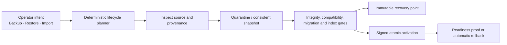
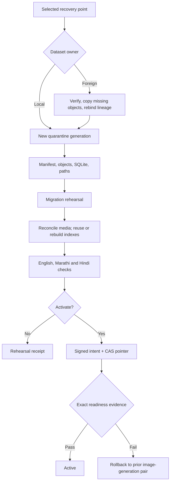

Status: Active operator contract; local and stage recovery certified
Audience: operators, developers, reviewers
Owner: FlowDocs maintainers
Last verified: 2026-08-07

# Data Operations v3 architecture

DataOps v3 is the only operator-facing data-lifecycle product. It supports
backup, restore, and import for development, stage, and production without
requiring operators to assemble internal storage routes from profile selectors
and feature flags.

VaultOps is not a supported product, workbench, or operator configuration
contract. The package is nevertheless still installed because DataOps v3 uses
its signed-activation/runtime primitives as an internal bridge and search
maintenance retains selected authenticated endpoints and durable records.
Legacy profile, sync, retention, GC, and mutation API paths remain routed for
compatibility but their operator feature gates are default-off; they are
code-removal debt, not deleted code. The former mixed-control page redirects to
DataOps.

## The operator contract

The normal workbench has three primary actions:

| Action | Operator chooses | DataOps decides |
| --- | --- | --- |
| Back up | Optional description | Consistent snapshot, changed objects, retries, manifest, verification, retention |
| Restore | Recovery point | Same-dataset recovery, compatibility work, quarantine, reindex, activation gates |
| Import | Readable legacy/v2/v3 object-store source | Format detection, canonicalization, cross-dataset rebind, destination generation |

An isolated recovery test and rollback are secondary actions. Clone/rebind,
copy, sync, promote, source profile, destination profile, and same-dataset
exceptions are internal transitions—not operator choices.



## Five invariants

1. Every published recovery point has a complete, independently restorable
   manifest.
2. Physical transfer is incremental: unchanged content-addressed objects are
   reused rather than uploaded again.
3. Restore and import always assemble a new quarantine/runtime generation;
   they never write into the active generation.
4. Dataset ownership decides the route automatically: same dataset means
   restore; a foreign dataset means import/rebind then restore.
5. Activation is a separately signed, compare-and-swap operation tied to the
   exact plan, image, generation, and manifest digest.

An activating preview is read-only and returns its exact plan-bound
confirmation token directly. Operators and clients never send a placeholder
confirmation merely to discover the token; the start endpoint still rejects a
missing, stale, or mismatched token before it queues an operation.

## Full and incremental backup

“Full” describes the recovery point. “Incremental” describes transfer and
storage.

```text
Recovery point 1
  Complete manifest: database + all uploaded PDFs + compatible derived artifacts
  Network transfer: every object

Recovery point 2
  Complete manifest: database + the same uploaded PDFs + compatible derived artifacts
  Network transfer: changed SQLite snapshot and only changed/new objects

Restore point 2
  Reads one complete manifest; it never replays a chain of delta archives
```

SQLite remains one consistent blob per recovery point. Page-level database
incrementals are deliberately out of scope until real storage evidence proves
they are worth their added corruption and restore complexity.

Authoritative components are SQLite and uploaded media/PDFs. PDF cache, FAISS,
and Chroma may be reused only when their recorded configuration is compatible;
otherwise DataOps rebuilds them in quarantine. Static files, Redis, local
backup history, control databases, credentials, and restore workspaces are not
backup payloads.

An absent optional derived tree is signed explicitly as coherent and empty.
The publisher must prove that its inventory contains no files for that tree,
and restore creates an empty directory only when the target is absent or empty.
A present Chroma tree is currently preserved as rebuild-required and remains
fail-closed until a supported compatibility/rebuild implementation exists.

## Lifecycle planning

[`flowdocs/dataops/lifecycle.py`](../../flowdocs/dataops/lifecycle.py) is pure:
it does not read settings, resolve secrets, contact storage, or mutate runtime
state. It compiles a secret-free plan from:

- operator intent;
- immutable instance identity;
- source artifact provenance;
- discovered capabilities;
- current active generation.

The plan records the selected route, ordered steps, safety gates, reasons,
refusal codes, and a deterministic SHA-256 digest. The executor must persist
that exact digest in checkpoints, receipts, and activation evidence.

### Automatic route table

| Intent and source | Route | Result |
| --- | --- | --- |
| Backup, no previous point | Baseline backup | Full upload and complete manifest |
| Backup, previous point exists | Smart backup | Upload missing/changed objects and publish a complete manifest |
| Restore, source owns target dataset | Same-dataset restore | New quarantined generation; optional signed activation |
| Restore, source owns another dataset | Import/rebind/restore | Target-owned manifest with preserved parent lineage |
| Import, legacy read-only mount | Preview only | Direct mounted-source execution is not exposed; first publish it with the reviewed migration tool |
| Import, legacy object store | Format inspection/canonicalization | Read-only source converted to a target-owned recovery point |
| Test recovery | Isolated rehearsal | Disposable data/control roots; activation forbidden |
| Selected point already active | No-op | Idempotent success receipt |
| Rollback | Signed pair rollback | Compatible image-generation pair and atomic pointer swap |

The planner fails closed for incomplete identity, unreadable sources, mutable
legacy mounts, invalid or missing v3 signatures, incomplete object sets,
unwritable quarantine, unavailable signing/activation, or missing operator
confirmation.

## Artifact provenance

The planner uses an internal `ArtifactPassport` value object. This is not a new
operator product or another database profile. It is the normalized inspection
result for a legacy layout, v2 generation, v3 recovery point, or previous
runtime pair.

The immutable v3 manifest carries the durable equivalent:

| Group | Required evidence |
| --- | --- |
| Ownership | Dataset ID, recovery point/generation ID, source instance |
| Integrity | Canonical manifest digest, signature, file sizes and SHA-256 values |
| Application | Image digest, release, database schema/migration fingerprint |
| Index compatibility | Embedding model, chunking and index format fingerprint |
| Lineage | Parent dataset, generation, manifest digest, and import transition |
| Completeness | Database/media required; cache and indexes marked reusable or rebuild-required |

Unknown legacy provenance is provisional. It becomes verified only after the
source is scanned twice without mutation, SQLite integrity and foreign keys
pass, included files are hashed, the remote candidate is read back, and the
canonical manifest is published.

## Import and migration

### Mounted legacy application capture

The current DataOps v3 workbench does not execute a direct mounted-volume
import. A reviewed operator container or migration command must first convert
the read-only mount into a verified immutable object-store source. DataOps v3
then imports that source through its normal object-store path:

1. Mount the source read-only.
2. Discover SQLite, media/PDFs, PDF cache, FAISS, and Chroma.
3. Take the first metadata/hash scan and a consistent SQLite snapshot.
4. Verify SQLite integrity and foreign keys.
5. Take the second scan and compare it to the first.
6. Retry on mutation; request a short write freeze only if retries cannot
   converge.
7. Upload and read back content-addressed objects.
8. Publish a target-owned immutable manifest using a conditional write.
9. Select the resulting object-store source in DataOps v3 and restore through
   the normal quarantine pipeline.

The source volume is never used as the destination and never becomes the
active runtime directory.

### Existing S3/RustFS source

DataOps detects v3, v2, known legacy layout, flat object collection, incomplete
upload, or unknown layout. A valid same-dataset v3 point uses normal restore. A
valid foreign v3/v2 point is automatically rebound into the local dataset. An
unknown layout is inventoried but refused if database/media ownership remains
ambiguous.

Cross-dataset import preserves:

```json
{
  "parent_dataset_id": "ai-sahakar-prod-v2",
  "parent_generation_id": "legacy-20260802...",
  "parent_manifest_sha256": "...",
  "transition": "import_rebind"
}
```

The source stays immutable. Destination collisions are accepted only for a
byte-identical idempotent retry; conflicting bytes are an integrity failure.

## Restore and activation



Production candidate preparation uses the same import/restore engine and stays
isolated from the active runtime. Runtime activation is currently rejected in
production before pointer mutation; a future production implementation must
add a verified pre-restore recovery point, maintenance window, rollback
authority, and brief mutation barrier. With SQLite, a zero-loss final switch
cannot accept concurrent writes without journaling or dual-write support.

## Configuration direction

Standard operation should depend on application identity plus one owned
recovery connection, not profile choreography.

Required identity and control:

```dotenv
APP_ENV=staging
DEPLOYMENT_ID=stage-2026
DATASET_ID=ai-sahakar-stage-2026
DATAOPS_ENABLED=1
```

Connection metadata and policy are persisted in the control database after an
optional environment/bootstrap seed. Credentials remain references resolved
inside the worker. Runtime path defaults derive from `DATA_ROOT` and
`DATA_CONTROL_ROOT`.

The supported v3 operator contract has:

- zero backup/restore source/destination selectors;
- zero operator-visible clone/rebind flags;
- zero same-dataset restore exceptions;
- zero profile roles;
- zero public VaultOps settings;
- zero secret values in manifests, plans, receipts, UI exports, or logs.

These are operator-contract guarantees, not a claim that every legacy setting,
model, or route has already been deleted from the implementation.

## Environment behavior

| Environment | Backup | Restore/import | Activation |
| --- | --- | --- | --- |
| Development | Manual by default | Supported | Local confirmation |
| Stage | Manual by default; real test supported | Supported | Explicit signed confirmation |
| Production | Policy-dependent after storage certification | Supported for isolated candidate preparation | Runtime activation is currently hard-disabled in production and requires a future reviewed implementation |

Environment changes gate strength and defaults. It does not remove backup or
restore capability.

## Compatibility-removal rule

DataOps v3 has proved legacy object-store import, signed stage activation,
manual stage backup, and isolated round-trip restore. The operator/UI cutover
is complete, but code cleanup is not: legacy selectors, jobs, the
authenticated internal VaultOps API, duplicate profile models, scheduler
paths, and special-case flags remain. They must not publish alongside v3 in a
normal deployment.

Remove them only in a separate reviewed impact-analysis PR that first migrates
search-maintenance callers, the runtime supervisor, activation models and
services, database history, settings imports, integration fixtures, and worker
scheduling. Until then, document them as internal compatibility and keep their
feature gates off by default.

## Certification evidence boundary

Local and stage rehearsals have exercised foreign legacy object-store import,
candidate preparation, multilingual OCR/index repair, signed stage activation,
manual backup, and disposable restore. Those are capability claims, not fixed
inventory claims. Exact source/destination generations, counts, byte totals,
digests, image identities, and dated defects are preserved in
[`../STATUS-2026-08-03.md`](../STATUS-2026-08-03.md) and the living
[`../HANDOFF.md`](../HANDOFF.md). Repeat the relevant gates whenever storage,
manifest, restore, activation, migration, image, OCR, or embedding contracts
change.
