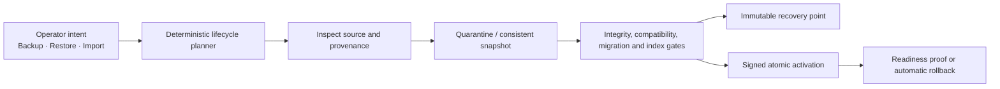
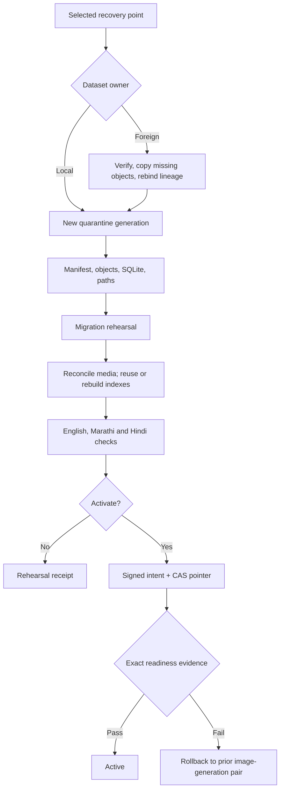

Status: Local and stage rehearsal passed; final immutable release pending
Audience: operators, developers, reviewers
Owner: FlowDocs maintainers
Last verified: 2026-08-03

# Data Operations v3 architecture

DataOps v3 is the only operator-facing data-lifecycle product. It supports
backup, restore, and import for development, stage, and production without
requiring operators to assemble internal storage routes from profile selectors
and feature flags.

VaultOps is not being brought back as a product, UI, API, or configuration
contract. During the transition, proven low-level safety functions may run
behind DataOps adapters. Those functions include consistent snapshotting,
immutable publication, quarantine restore, signed activation, compare-and-swap
runtime pointers, and rollback. Their old operator surfaces are retired after
DataOps v3 passes local and real-stage certification.

## The operator contract

The normal workbench has three primary actions:

| Action | Operator chooses | DataOps decides |
| --- | --- | --- |
| Back up | Optional description | Consistent snapshot, changed objects, retries, manifest, verification, retention |
| Restore | Recovery point | Same-dataset recovery, compatibility work, quarantine, reindex, activation gates |
| Import | Read-only legacy mount or storage source | Format detection, canonicalization, cross-dataset rebind, destination generation |

An isolated recovery test and rollback are secondary actions. Clone/rebind,
copy, sync, promote, source profile, destination profile, and same-dataset
exceptions are internal transitions—not operator choices.



## Five invariants

1. Every published recovery point has a complete, independently restorable
   manifest.
2. Physical transfer is incremental: unchanged content-addressed objects are
   reused rather than uploaded again.
3. Restore and import always assemble a new quarantine/runtime generation;
   they never write into the active generation.
4. Dataset ownership decides the route automatically: same dataset means
   restore; a foreign dataset means import/rebind then restore.
5. Activation is a separately signed, compare-and-swap operation tied to the
   exact plan, image, generation, and manifest digest.

An activating preview is read-only and returns its exact plan-bound
confirmation token directly. Operators and clients never send a placeholder
confirmation merely to discover the token; the start endpoint still rejects a
missing, stale, or mismatched token before it queues an operation.

## Full and incremental backup

“Full” describes the recovery point. “Incremental” describes transfer and
storage.

```text
Recovery point 1
  Complete manifest: database + 242 PDFs + compatible derived artifacts
  Network transfer: every object

Recovery point 2
  Complete manifest: database + the same 242 PDFs + compatible derived artifacts
  Network transfer: changed SQLite snapshot and only changed/new objects

Restore point 2
  Reads one complete manifest; it never replays a chain of delta archives
```

SQLite remains one consistent blob per recovery point. Page-level database
incrementals are deliberately out of scope until real storage evidence proves
they are worth their added corruption and restore complexity.

Authoritative components are SQLite and uploaded media/PDFs. PDF cache, FAISS,
and Chroma may be reused only when their recorded configuration is compatible;
otherwise DataOps rebuilds them in quarantine. Static files, Redis, local
backup history, control databases, credentials, and restore workspaces are not
backup payloads.

An absent optional derived tree is signed explicitly as coherent and empty.
The publisher must prove that its inventory contains no files for that tree,
and restore creates an empty directory only when the target is absent or empty.
A present Chroma tree is currently preserved as rebuild-required and remains
fail-closed until a supported compatibility/rebuild implementation exists.

## Lifecycle planning

[`flowdocs/dataops/lifecycle.py`](../../flowdocs/dataops/lifecycle.py) is pure:
it does not read settings, resolve secrets, contact storage, or mutate runtime
state. It compiles a secret-free plan from:

- operator intent;
- immutable instance identity;
- source artifact provenance;
- discovered capabilities;
- current active generation.

The plan records the selected route, ordered steps, safety gates, reasons,
refusal codes, and a deterministic SHA-256 digest. The executor must persist
that exact digest in checkpoints, receipts, and activation evidence.

### Automatic route table

| Intent and source | Route | Result |
| --- | --- | --- |
| Backup, no previous point | Baseline backup | Full upload and complete manifest |
| Backup, previous point exists | Smart backup | Upload missing/changed objects and publish a complete manifest |
| Restore, source owns target dataset | Same-dataset restore | New quarantined generation; optional signed activation |
| Restore, source owns another dataset | Import/rebind/restore | Target-owned manifest with preserved parent lineage |
| Import, legacy read-only mount | Legacy canonicalization | Stable two-scan package, remote verification, normal restore path |
| Import, legacy object store | Format inspection/canonicalization | Read-only source converted to a target-owned recovery point |
| Test recovery | Isolated rehearsal | Disposable data/control roots; activation forbidden |
| Selected point already active | No-op | Idempotent success receipt |
| Rollback | Signed pair rollback | Compatible image-generation pair and atomic pointer swap |

The planner fails closed for incomplete identity, unreadable sources, mutable
legacy mounts, invalid or missing v3 signatures, incomplete object sets,
unwritable quarantine, unavailable signing/activation, or missing operator
confirmation.

## Artifact provenance

The planner uses an internal `ArtifactPassport` value object. This is not a new
operator product or another database profile. It is the normalized inspection
result for a legacy layout, v2 generation, v3 recovery point, or previous
runtime pair.

The immutable v3 manifest carries the durable equivalent:

| Group | Required evidence |
| --- | --- |
| Ownership | Dataset ID, recovery point/generation ID, source instance |
| Integrity | Canonical manifest digest, signature, file sizes and SHA-256 values |
| Application | Image digest, release, database schema/migration fingerprint |
| Index compatibility | Embedding model, chunking and index format fingerprint |
| Lineage | Parent dataset, generation, manifest digest, and import transition |
| Completeness | Database/media required; cache and indexes marked reusable or rebuild-required |

Unknown legacy provenance is provisional. It becomes verified only after the
source is scanned twice without mutation, SQLite integrity and foreign keys
pass, included files are hashed, the remote candidate is read back, and the
canonical manifest is published.

## Import and migration

### Mounted legacy application

1. Mount the source read-only.
2. Discover SQLite, media/PDFs, PDF cache, FAISS, and Chroma.
3. Take the first metadata/hash scan and a consistent SQLite snapshot.
4. Verify SQLite integrity and foreign keys.
5. Take the second scan and compare it to the first.
6. Retry on mutation; request a short write freeze only if retries cannot
   converge.
7. Upload and read back content-addressed objects.
8. Publish a target-owned immutable manifest using a conditional write.
9. Restore that recovery point through the normal quarantine pipeline.

The source volume is never used as the destination and never becomes the
active runtime directory.

### Existing S3/RustFS source

DataOps detects v3, v2, known legacy layout, flat object collection, incomplete
upload, or unknown layout. A valid same-dataset v3 point uses normal restore. A
valid foreign v3/v2 point is automatically rebound into the local dataset. An
unknown layout is inventoried but refused if database/media ownership remains
ambiguous.

Cross-dataset import preserves:

```json
{
  "parent_dataset_id": "ai-sahakar-prod-v2",
  "parent_generation_id": "legacy-20260802...",
  "parent_manifest_sha256": "...",
  "transition": "import_rebind"
}
```

The source stays immutable. Destination collisions are accepted only for a
byte-identical idempotent retry; conflicting bytes are an integrity failure.

## Restore and activation



Production uses the same engine. It adds an automatic pre-restore recovery
point, maintenance window, rollback authority, and a brief mutation barrier at
activation. Preparation, transfer, migrations, indexing, and tests remain
offline. With SQLite, a zero-loss restore cannot accept concurrent writes at
the final switch without journaling or dual-write support; reads may remain
available while writes are briefly paused.

## Configuration direction

Standard operation should depend on application identity plus one owned
recovery connection, not profile choreography.

Required identity and control:

```dotenv
APP_ENV=staging
DEPLOYMENT_ID=stage-2026
DATASET_ID=ai-sahakar-stage-2026
DATAOPS_ENABLED=1
```

Connection metadata and policy move to the control database or an optional
versioned bootstrap file. Credentials are secret-provider references resolved
inside the worker. Runtime path defaults derive from `DATA_ROOT` and
`DATA_CONTROL_ROOT`.

The target contract has:

- zero backup/restore source/destination selectors;
- zero operator-visible clone/rebind flags;
- zero same-dataset restore exceptions;
- zero profile roles;
- zero public VaultOps settings;
- zero secret values in manifests, plans, receipts, UI exports, or logs.

## Environment behavior

| Environment | Backup | Restore/import | Activation |
| --- | --- | --- | --- |
| Development | Manual by default | Supported | Local confirmation |
| Stage | Manual by default; real test supported | Supported | Explicit signed confirmation |
| Production | Scheduled after storage certification | Supported | Pre-backup, maintenance window, signed approval, atomic swap and rollback |

Environment changes gate strength and defaults. It does not remove backup or
restore capability.

## Transition rule

DataOps v2 and VaultOps may be read as compatibility sources while v3 is being
certified. They must not both publish new recovery points. After v3 proves
legacy import, 242-document stage activation, stage backup, and isolated
round-trip restore, obsolete selectors, jobs, public VaultOps routes, duplicate
profile models, and special-case environment flags can be removed in reviewed
commits.

## Real local certification — 2026-08-03

The exact read-only production-v2 generation
`legacy-20260802T085639Z-86288855` was imported from RustFS into the local
development recovery bucket and restored into an isolated candidate. Neither
the production source nor the active local application volume was a write
target.

| Evidence | Observed result |
| --- | --- |
| Source dataset | `ai-sahakar-prod-v2` |
| Source manifest SHA-256 | `b59593fbc3f772b331110bdc6b1a590c1bd944c6f40900b2caf8e01a03cf8843` |
| Source before/after manifest | Exact digest unchanged |
| Imported logical entries / bytes | 416 / 1,093,501,777 |
| Destination unique objects / bytes | 280 / 1,052,703,487 |
| Destination v3 manifest SHA-256 | `d1ec9beacaa0b5dc5212619a989a5603174d5f83becac30d0a516c4870b7aff6` |
| Legacy database | 242 documents, 46 folders, 7 users, 29 source migrations |
| SQLite | Integrity `ok`; zero foreign-key violations; 64 current migration rows after rehearsal |
| Candidate repair | 9 image-only PDFs OCRed/embedded; 45 searchable folder indexes rebuilt |
| Candidate index | 7,615 vectors, dimension 1,536, indexing ratio `1.0` |
| Text coverage | 242 with text; 239 Latin-script; 206 Devanagari; 9 with OCR evidence |
| Candidate database SHA-256 | `d79e8354d180a017bc305dc4303562e4956f906ed92b58fce7a11d1aa13b33ab` |
| Activation | Not performed; active pointer and active volumes unchanged |

The exercise found and fixed six real defects before stage: the legacy user
table was incorrectly assumed to be `auth_user`; cached import evidence did not
refresh after adapter upgrades; candidate retries lost cumulative repair
evidence; the all-folder repair query used the wrong Django relation name; the
credential-free provider produced vectors with a different dimension from the
configured embedding model; and a successful non-activating import crashed
while recording its audit receipt because `activation` was `null`.

Embedding dimensions are now a code-owned contract for supported models. The
candidate command compares stored vectors with the configured model before it
quarantines indexes or queues OCR/reindex work. A changed or unknown model fails
closed and requires an explicit full reindex design; it is never repaired by
mixing new vectors into an old vector space. Test embeddings use the same
dimension as the configured model. Successful operation state and its audit
receipt are committed together, so an audit failure cannot leave an unaudited
success row.

The retained `a5` failure was replayed read-only and rejected at preflight with
`candidate_embedding_model_dimension_mismatch`. The corrected code then
revalidated the retained 242-document `a6` candidate as reusable. The approved
rehearsal enabled embeddings only inside the isolated candidate process.

The certified image contains Tesseract English, Marathi, and Hindi language
packs, `cryptography` 48.0.1, and no runtime `setuptools` or `wheel` package.
Stage remains the next gate: publish the branch image by immutable digest,
repeat import/candidate preparation, run representative searches, activate
with signed evidence, publish one stage backup, and restore it into disposable
volumes.
