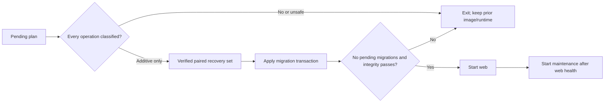

# Activated-runtime migration gap and rollback

Status: Resolved and verified on stage

Date: 2026-08-04

Environment: `2026.ai-sahakar.net` stage

Production impact: None

## Summary

The certified document-workbench image introduced additive migration
`core.0028_uploadbatch_uploadbatchitem`. Stage already had a signed active
runtime. The previous startup contract allowed mutable bootstrap migrations but
rejected every pending migration once activation was enabled. Consequently the
new web container created/reused verified pre-migration recovery evidence and
then exited before Gunicorn. The deployment script restored the previous exact
image digest; stage returned to healthy with the same signed generation and
`indexing_ratio=1.0`.

No production service, production volume, stage runtime pointer, document, or
index was changed.

## Root cause

The safety rule correctly prohibited an unreviewed migration from mutating the
active database, but it made no distinction between additive schema creation
and data-destructive/custom operations. It also offered no normal release path
for the common additive case. Operators were therefore forced toward either an
overbuilt candidate ceremony or an unsafe manual bypass.

## Corrective design

Activated web startup now delegates to one bounded command:
`apply_safe_runtime_migrations`.



The classifier accepts new tables, new indexes, state-only model options or
managers, and field metadata changes that Django confirms are database no-ops.
All other operation classes fail closed. There is no new environment switch.

## Resolution evidence

PR [#181](https://github.com/Nimble-esolutions/PdfSearch/pull/181) passed the
source/deployment, documentation, fast-contract, and pre-merge gates before it
was rebased into `dev` at
`e0d0858da542cb14ab6f496e002a5b233cd4dec4`. The post-merge release pipeline
then rebuilt, entrypoint-smoked, scanned, size-checked, and promoted this exact
image:

```text
ghcr.io/nimble-esolutions/pdfsearch/shakar-frontend@sha256:1611a6ae7678b01cada362686a2c8cb35325665dfb04ab7f96a3f2db290bebb5
```

The guarded stage retry produced the following evidence:

| Proof | Observed result |
| --- | --- |
| Pending migration | `core.0028_uploadbatch_uploadbatchitem` |
| Classification | One state-only `AlterField` and two additive `CreateModel` operations |
| Recovery evidence | Verified paired set created before migration |
| Migration result | Applied; subsequent plan empty |
| Data inventory | 242 PDF rows, 46 folders, 242 indexed PDFs |
| Runtime authority | Existing signed generation and manifest remained unchanged |
| Readiness | Root, liveness, and readiness returned HTTP 200; every readiness check was `ok` |
| Web/maintenance image | Same immutable digest and OCI revision; both healthy |
| Production | Unchanged and uninterrupted |

Stage repair and reindex previews initially remained unavailable for the
separate, correctly reported reason `mutation_tracking_disabled`. The stage
environment was missing the existing `VAULT_MUTATION_TRACKING_ENABLED` safety
setting while all other maintenance prerequisites were already enabled. It was
enabled atomically with file mode `0600`; no credential value or new setting was
introduced. `MAINTENANCE_CANDIDATE_WRITER_MODE` deliberately remains disabled
because an active runtime must never run as an isolated candidate writer.

Authenticated stage fitness checks then proved:

- the maintenance page renders without the stale “active search source is not
  verified” blocker;
- all four maintenance capabilities are available and no shared blocker remains;
- validation and stored-index repair each preview all 242 documents without
  queueing a job;
- “reindex only what is needed” returns the stable, explanatory `empty_scope`
  response when every document is already indexed, rather than an HTTP 500;
- temporary preview plans created by verification were removed.

## Impact analysis

| Boundary | Before | After | Failure behavior |
| --- | --- | --- | --- |
| Existing rows and documents | Any pending plan blocked startup | Additive plans do not rewrite rows | Unknown/data-changing plan exits before migration |
| SQLite recovery | Startup created evidence but could not proceed | Verified application/control set precedes apply | Previous exact image remains rollback target |
| Signed runtime pointer | Unchanged | Unchanged | Never hand-edited or redirected |
| Web/maintenance ordering | Orchestrator could recreate both | Web proves schema health first | Maintenance stays stopped/unstarted |
| Configuration | Operators were tempted to add bypass flags | No new variable | Classifier is code-reviewed and tested |
| Production | No deployment | No deployment | Future use still requires certified release and normal rollout evidence |

## Durable rules

- Never disable activation or repoint paths to make `migrate` reach the active
  database.
- Never fake `django_migrations` rows or apply ad hoc SQL.
- Every migration-bearing PR must test its activated-runtime classification.
- Unsafe plans use isolated rehearsal or an expand-contract release.
- Record the old and new exact image digests before stage/prod rollout and
  prove signed readiness after automatic rollback.
- Enable mutation tracking before exposing repair or reindex controls on a
  writable stage or production runtime; do not substitute candidate-writer mode
  on an active runtime.
