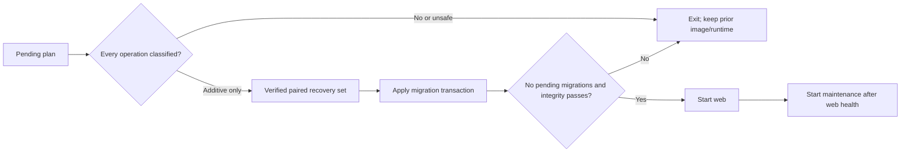

# Activated-runtime migration gap and rollback

Status: Corrective implementation in review

Date: 2026-08-04

Environment: `2026.ai-sahakar.net` stage

Production impact: None

## Summary

The certified document-workbench image introduced additive migration
`core.0028_uploadbatch_uploadbatchitem`. Stage already had a signed active
runtime. The previous startup contract allowed mutable bootstrap migrations but
rejected every pending migration once activation was enabled. Consequently the
new web container created/reused verified pre-migration recovery evidence and
then exited before Gunicorn. The deployment script restored the previous exact
image digest; stage returned to healthy with the same signed generation and
`indexing_ratio=1.0`.

No production service, production volume, stage runtime pointer, document, or
index was changed.

## Root cause

The safety rule correctly prohibited an unreviewed migration from mutating the
active database, but it made no distinction between additive schema creation
and data-destructive/custom operations. It also offered no normal release path
for the common additive case. Operators were therefore forced toward either an
overbuilt candidate ceremony or an unsafe manual bypass.

## Corrective design

Activated web startup now delegates to one bounded command:
`apply_safe_runtime_migrations`.

The classifier accepts new tables, new indexes, state-only model options or
managers, and field metadata changes that Django confirms are database no-ops.
All other operation classes fail closed. There is no new environment switch.

## Impact analysis

| Boundary | Before | After | Failure behavior |
| --- | --- | --- | --- |
| Existing rows and documents | Any pending plan blocked startup | Additive plans do not rewrite rows | Unknown/data-changing plan exits before migration |
| SQLite recovery | Startup created evidence but could not proceed | Verified application/control set precedes apply | Previous exact image remains rollback target |
| Signed runtime pointer | Unchanged | Unchanged | Never hand-edited or redirected |
| Web/maintenance ordering | Orchestrator could recreate both | Web proves schema health first | Maintenance stays stopped/unstarted |
| Configuration | Operators were tempted to add bypass flags | No new variable | Classifier is code-reviewed and tested |
| Production | No deployment | No deployment | Future use still requires certified release and normal rollout evidence |

## Durable rules

- Never disable activation or repoint paths to make `migrate` reach the active
  database.
- Never fake `django_migrations` rows or apply ad hoc SQL.
- Every migration-bearing PR must test its activated-runtime classification.
- Unsafe plans use isolated rehearsal or an expand-contract release.
- Record the old and new exact image digests before stage/prod rollout and
  prove signed readiness after automatic rollback.
