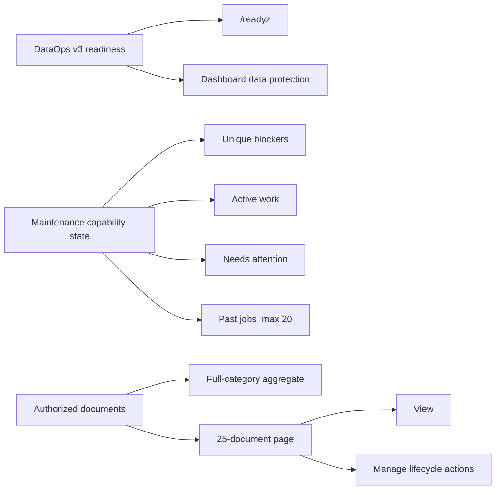

# Operator workbench truth and scale correction

## Outcome

This release removes three operator-facing failure modes without changing the
underlying mutation safety gates:

| Before | After |
| --- | --- |
| Dashboard reconstructed readiness from a legacy Vault projection | Dashboard and `/readyz` use the same bounded DataOps v3 readiness payload |
| One capability problem appeared repeatedly on several maintenance cards | Every unique blocker is explained once and linked to affected actions |
| Newer terminal jobs could hide an older active job | Active and actionable jobs are queried independently; only inert history is bounded |
| All categories appeared as malformed full-width checkboxes | Searchable category grid, 16–20 px checkboxes, 44 px labels, select-visible, and clear controls |
| Six-column PDF table exposed six or more actions per row | Responsive document records expose View plus an explicit Manage disclosure |
| Every document in a category rendered at once | Full metrics plus deterministic 25-document pages |
| Successful logins consumed the failed-attempt limit | Successful authentication clears the failed-attempt counter |
| Deployment validation rejected the approved stage `:latest` channel | Stage permits one shared always-pulled image reference; production still requires an immutable digest |

## Read-model flow



## Safety properties retained

- Maintenance mutations remain POST-only and superadmin-only.
- Preview expiry, idempotency, non-empty scope, state-version checks,
  source-digest revalidation, recovery-set creation, and exact confirmation are
  unchanged.
- Ordinary admins can inspect state but do not receive dead mutation buttons.
- Rename and owner assignment preserve only validated same-origin return URLs.
- Recovery-evidence validation reopens the exact document/action disclosure;
  errors and autofocus are not hidden.
- Full-category statistics are calculated before pagination.

## Scale and accessibility contract

| Surface | Fixture/gate | Acceptance |
| --- | --- | --- |
| Dashboard | unbroken long title in recent intake | no root horizontal overflow |
| PDF workbench | 105 documents, long English token, Marathi title, unknown owner | 25 records on page 1, five pages, no internal overflow |
| PDF actions | closed and expanded Manage disclosure | 44 px View/Manage targets, keyboard operation, lifecycle actions retained |
| Search maintenance | 46+ categories | filter/select/clear work, checkbox 16–20 px, label at least 44 px |
| Accessibility | desktop and mobile | no serious or critical Axe violations |
| Localization | English and Marathi catalogs | new operator strings compile successfully |

## Verified commands

```bash
ALLOW_INSECURE_DEFAULTS=1 APP_ENV=development \
  .venv/bin/python flowdocs/manage.py test \
  core.tests.LoginRateLimitTests core.tests.DashboardTests --keepdb

docker compose -f docker-compose.dev.yml build web maintenance
docker compose -f docker-compose.dev.yml up -d --no-deps web maintenance
docker compose -f docker-compose.dev.yml exec -T --user appuser web \
  env ADMIN_SMOKE_USERNAME=ci-admin python /app/scripts/ci/admin_ui_smoke.py

PLAYWRIGHT_BASE_URL=http://127.0.0.1:8000 npx playwright test \
  browser_tests/operations-cockpit.spec.ts \
  --project=desktop --project=mobile --workers=1
```

Focused core/DataOps tests, image build, HTTP smoke, desktop Playwright, and
mobile Playwright passed locally. The complete hosted workflow remains the
merge gate.

## Stage deployment and rollback

Stage intentionally sets both `PDFSEARCH_IMAGE` and `APP_IMAGE_DIGEST` to the
approved `:latest` channel. After merge:

1. publish/update `:latest`;
2. let Dokploy pull and recreate both web and maintenance;
3. record the resolved running digest and OCI revision;
4. verify `/livez`, `/readyz`, Dashboard parity, Search Maintenance, the
   242-document category metrics, and English/Marathi searches;
5. retain the previous resolved digest as rollback evidence.

Production is different: it must be promoted and rolled back by immutable
digest. This release does not change production traffic, DNS, or data.
