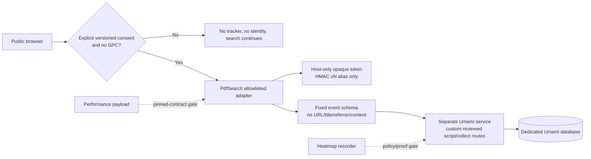

# Plan 038: Extend consent-led Umami measurement without expanding identity scope

> **Executor instructions:** This plan is deliberately capability-by-capability.
> Do not enable a generic Umami feature flag merely because the remote dashboard
> offers it. Read the current consent-led analytics contract, Settings
> operations guide, privacy/cookie/data policy, UI contract, and the exact
> pinned Umami release documentation before editing. The current analytics
> candidate must be merged/rebased and verified against `dev` first.

## Status

- **Priority:** P1
- **Effort:** L
- **Risk:** HIGH — browser analytics can disclose visitor behaviour or make a
  public route slower if its boundary is weakened
- **Depends on:** the consent-led analytics candidate, Settings control-center
  baseline, Plan 006 verification gate; performance release stage also depends
  on Plans 035 and 036 evidence
- **Planned at:** `3591956` on 2026-08-07
- **Roadmap status:** TODO / policy-gated

## Objective

Expand the existing privacy-first, manual Umami adapter only where the
capability can remain consent-led, content-free, tenant-isolated, and
non-blocking. Improve delivery reliability, measure approved named outbound
actions, retain the existing anonymous repeat-visitor alias, and evaluate
real-user performance. Do **not** add generic automatic tracking, account
identity, cross-site identity, session replay, or public heatmaps without a
separate policy decision and a controlled proof.

## Current boundary to preserve

The candidate adapter is intentionally stricter than Umami defaults:

```text
allowed public host + enabled local setting + explicit consent + no GPC
    -> host-only opaque cookie
    -> host-bound HMAC alias (not the raw token)
    -> manual allowlisted event
    -> beforeSend builds a fixed, content-free payload

everything else -> no script / no event / public search continues
```

The application currently hard-disables local/preview collection, keeps stage
and future production website IDs separate, canonicalizes the 2026 production
`www` host before application/session handling, and avoids a shared
`.ai-sahakar.net` cookie. These are security and privacy requirements, not
implementation conveniences.

## Root-cause and capability matrix

| Capability | External contract | Gap in current app | Decision |
| --- | --- | --- | --- |
| Delivery under blocker heuristics | Self-hosted Umami can rename its tracker and collect endpoints with `TRACKER_SCRIPT_NAME` and `COLLECT_API_ENDPOINT`. | Application hard-codes the reviewed `/script.js` path, and service delivery proof is manual. | Add a code-owned, versioned custom service route after a stage canary; do not proxy through PdfSearch first. |
| Outbound links | Umami's generic example records `data-umami-event-url` and can auto-scan anchors. | That would export raw target URLs and track accidental links. | Reject generic scanning; emit a fixed category only from explicitly annotated public anchors. |
| Distinct IDs | `umami.identify()` supports a 50-character distinct ID. | The current candidate already derives a versioned, host-bound HMAC alias below that limit. | Retain the design; add resilience/audit coverage rather than replacing it. |
| Performance | `data-performance=true` sends RUM Core Web Vitals as a `performance` payload type. | The current final transport accepts only `identify` and allowed `event` payloads; remote payload shape/timing has not been proven. | Keep disabled until a pinned-version stage compatibility spike proves a sanitized allowlist and no first-load regression. |
| Heatmaps | Umami recorder configuration can enable heatmaps and exposes sample/mask/block settings. | Recorder collection is a materially more sensitive data class than event counters; current policy excludes replay/performance traces. | Do not deploy public heatmaps now. Policy owner approval and a content-safe recorder proof are hard gates. |

## Architecture decision



The Umami service remains a separate stack. PdfSearch does not call it from the
backend, does not use it for `/livez` or `/readyz`, and must continue to search
when it is unavailable. The route name is a **code-owned public integration
contract**, not an Admin Settings field and not a secret.

## Scope and non-goals

### In scope

1. A one-time, custom tracker and collector path configured in the Umami
   service and reflected in one reviewed application constant/test contract.
2. Manual, category-only public outbound actions.
3. Hardening and documenting the existing anonymous distinct-ID lifecycle.
4. A version-pinned, consented RUM performance compatibility spike followed by
   a staged implementation only if it satisfies the final transport policy.
5. A heatmap policy/proof decision with a safe default of off.
6. A small Settings control-center extension showing non-secret capability
   posture and delivery-proof freshness; it must not expose endpoint URLs,
   raw Website IDs beyond the existing safe display, credentials, or a generic
   feature matrix.

### Explicit non-goals

- No automatic Umami pageviews, generic event attributes, link scanning, raw
  URL/href/title/referrer export, document/PDF/download name tracking, or
  query/answer/source collection.
- No account, email, admin identity, cross-device identity, cross-host cookie,
  local collection, or stage/production tenant reuse.
- No session replay. Heatmaps are not included in the first implementation
  release and may remain permanently rejected if their data model cannot meet
  the policy gate.
- No reverse proxy through the PdfSearch application, no separate tracking
  SDK, no new broad environment-variable matrix, and no health/readiness
  dependency on Umami.

## Implementation sequence

### Phase 0 — reconcile implementation and establish policy gates

1. Rebase or merge the consent-led analytics candidate onto current `dev` and
   run its focused Django/browser/privacy tests. Compare the actual source with
   this plan; stop if the claimed `beforeSend`, consent, or host controls are
   absent.
2. Pin and record the Umami image digest, tracker version, migration level,
   custom tracker-script SHA-256, service owner, database backup/restore proof,
   retention/deletion owner, and dashboard access policy. Never record
   credentials in the repository or application settings.
3. Create an analytics data-classification decision with a privacy owner:
   current bounded events/alias; proposed Core Web Vitals; and recorder data.
   Version the public consent notice before expanding collection. Existing
   consent was made under an explicit no-performance/no-replay representation;
   it cannot silently authorize a material new purpose.
4. Inventory CSP, framing, proxy, and asset headers. There is no current
   application CSP/X-Frame-Options contract to relax. Start with a report-only
   inventory if a new policy is needed; do not weaken framing merely to show a
   dashboard heatmap preview.

### Phase 1 — delivery resilience without stealth or app coupling

1. Configure a neutral, documented tracker path and collector path in the
   **Umami service** via `TRACKER_SCRIPT_NAME` and `COLLECT_API_ENDPOINT`.
   Keep both on `analytics.ai-sahakar.net`; select the exact route names in the
   implementation PR, review them as a public API, and do not make them user
   editable.
2. Change the application endpoint constant, template configuration, strict
   JavaScript URL validation, and tests together. The script must still use
   the same reviewed analytics origin; do not set a separate `data-host-url`
   unless a reviewed service topology requires it.
3. Canary on stage with collection initially disabled, then with a consenting
   test visitor. Prove script delivery, custom collector receipt, expected
   CORS, allowed domain checks, service isolation, bounded retry/drop behavior,
   and no effect on search/readiness if the analytics service is stopped.
4. Prefer this service-owned custom-path option over a first-party proxy.
   Defer a proxy through `ai-sahakar.net` because it would couple application
   routing, failure modes, CSP, proxy logs, and incident response to analytics.
   Defer a copied static tracker because it introduces tracker-upgrade drift.

### Phase 2 — outbound actions as categories, never destinations

1. Define a closed enum for public actions such as `help`, `official_home`,
   `map`, `feedback`, and `whatsapp`. Add another value only with a written
   product question and data-review reason.
2. Annotate only reviewed public anchors with a semantic application attribute
   such as `data-product-analytics-outbound="help"`. Do not add
   `data-umami-event-*` attributes and do not inspect or transmit `href`.
3. Add one delegated click/keyboard handler inside the existing analytics
   adapter. It must validate the enum, observe the action without preventing
   navigation, and fail silently when consent/tracker is unavailable.
4. Reconcile existing help/feedback/share event emitters so one visitor action
   makes one durable analytics event. Preserve event compatibility with a
   versioned transition rather than silently double-counting a dashboard.
5. Test external and internal safe-link cases in Classic, Workbench, and
   public legal pages where applicable. Exclude error pages, admin, login,
   PDFs, raw source links, and any dynamically generated/document destination.

### Phase 3 — retain anonymous distinct identity deliberately

1. Keep the 256-bit random, HttpOnly, host-only token and the existing
   `vN_` HMAC alias. The alias must remain at or below the Umami 50-character
   limit, must include the exact collection hostname in its HMAC input, and
   must never be derived from account/user/profile/document/query data.
2. Treat identity rotation as normal: explicit reset, revoke, GPC, expiry, and
   application signing-key rotation create a fresh alias. Do not build a
   server-side mapping to recover or join aliases across rotations.
3. On a public page reached by an authenticated administrator, still use the
   anonymous public alias or no collection—never the account identity. The
   dashboard and administrative UI remain uninstrumented.
4. Extend leakage tests: no raw token in HTML, JavaScript, storage, requests,
   Umami events, logs, or Settings receipts; stable repeat alias only on the
   same exact approved host; no alias on local/preview/`www`/GPC/no-consent.

### Phase 4 — performance collection only after protocol proof

1. Use an isolated staging canary against the exact pinned Umami tracker to
   capture the real `beforeSend(type, payload)` inputs for `performance`.
   Confirm whether the callback runs before every RUM send and whether it can
   replace page/title/referrer/query data while retaining only allowed metric
   fields. Do not infer this from generic event documentation.
2. If and only if the proof succeeds, add a `performance` branch to the final
   transport schema. It may permit only metric name/value, bounded route alias
   (`/public/classic` or `/public/workbench`), coarse viewport/device class,
   Website ID, and exact approved hostname. Reject all unknown keys and all
   raw route/query/title/referrer/user input.
3. Treat it as consented RUM, not universal performance telemetry. Collect on
   a code-owned deterministic sample with the sample rate recorded in release
   evidence; start stage at a bounded pilot and production at zero until the
   stage pilot proves data quality and browser/network overhead. Do not add a
   free-form environment variable for sampling.
4. Track LCP, INP, CLS, FCP, and TTFB, reviewing p50/p75/p95 by approved fixed
   surface alias. Compare these with server-side route timing: RUM diagnoses
   visitor experience, not database/retrieval work by itself.
5. If Umami's built-in performance payload cannot be reduced to this schema,
   leave `data-performance` off. A separate, explicitly approved fallback may
   send a small app-owned Web Vitals event through the same manual allowlist,
   but it must be planned and tested as a different product contract.

### Phase 5 — heatmaps remain off pending a formal proof

1. Do not load `recorder.js` or enable a recorder configuration on public
   pages in this plan's first release. Umami's recorder configuration includes
   replay/heatmap flags, sample rate, masking, duration, and a block selector;
   it is not equivalent to aggregate click counters.
2. If a policy owner later requests an experiment, first run an isolated,
   disposable stage proof with synthetic content only. It must use strict
   masking, explicit block selectors for the entire chat transcript, composer,
   question/answer/source/PDF elements, authentication, settings, and all
   dynamic document content; disabled replay; the minimum approved heatmap
   sample; short retention; restricted dashboard roles; and no export/share
   link.
3. Inspect recorder network payloads and rendered recordings/heatmaps for
   every protected element. Stop permanently if any raw visitor text, source,
   document title, input, or account/admin content can be reconstructed.
4. Leave public errors, legal pages, login, admin, data operations, and all
   document/PDF routes outside heatmap coverage. Do not relax `frame-ancestors`
   or X-Frame-Options solely to embed a dashboard preview; use the Umami
   dashboard directly for evidence.
5. A production heatmap needs a separate approval after the stage proof,
   public policy/cookie notice update, retention/deletion procedure, and
   incident response owner. Default production state is off.

### Phase 6 — make Settings explain, not configure infrastructure

1. Extend the existing Settings control centre with a compact **Analytics
   posture** card: exact application host, tenant state, collection mode,
   consent schema version, delivery-proof freshness, capability status
   (events/outbound/identity/performance/heatmaps), and the next safe action.
2. Keep the existing host-scoped Website ID control and explicit enable
   confirmation. Do not expose collector URL, script path, image digest,
   credentials, database state, raw events, or an arbitrary feature-toggle
   grid.
3. Use a redacted, server-validated operator attestation/receipt for delivery
   canaries rather than making a backend health call to Umami. An expired or
   missing attestation informs the operator but does not break public search.
4. Apply the control-centre patterns: section-local validation, revision token,
   scoped result receipt, English/Marathi copy, keyboard flow, and no-JS safe
   fallback. Any high-risk capability change needs a server-side confirmation
   and policy reference.

## File-level implementation map

| File / area | Intended change | Guardrail |
| --- | --- | --- |
| `flowdocs/core/product_analytics.py` | Keep host profile, consent, HMAC alias, and code-owned tracker route contract. | No account identity, raw token, endpoint edit, or local enablement. |
| `flowdocs/core/static/main/js/product-analytics.js` | Add validated category-only outbound flow and, only after proof, a separate performance payload branch. | Final `beforeSend` stays deny-by-default; navigation never waits on tracking. |
| `flowdocs/core/templates/components/product_analytics.html` | Carry only approved script attributes/config. | Auto tracking remains false; no recorder by default. |
| Public templates | Add reviewed outbound category attributes only. | No raw `href` is copied into analytics markup or event data. |
| `dashboard_settings.html`, settings view/registry/tests | Explain posture and save non-secret attestations/receipts. | No secret/endpoint/service-topology edit surface. |
| Privacy/cookie/data-policy docs/templates | Version consent and state the approved data classes before performance/heatmap changes. | No retroactive consent expansion. |
| Umami service deployment/runbook | Configure custom paths, exact pinned version, retention, roles, migration/backup/restore proof. | Separate stack/database; no application readiness coupling. |
| Browser/Django tests | Add leak, GPC, hostname, tenant, outbound, performance, and no-recorder tests. | Sentinel content must never reach transport assertions. |

## Overall impact analysis

| Dimension | Benefit | Risk | Mitigation |
| --- | --- | --- | --- |
| Reliability | Custom service paths may reduce accidental blocking. | Route change can break delivery or increase proxy complexity. | One code-owned path, service canary, content hash/version proof, Settings kill switch, no first-party proxy initially. |
| Data quality | Named outbound actions and stable anonymous aliases support usable funnels/returning-visitor counts. | URL/category drift or duplicate events corrupts reporting. | Closed enum, one adapter owner, schema version, event transition audit, tenant-specific dashboards. |
| Privacy | HMAC aliases avoid raw identity; consent/GPC remain authoritative. | Persistent identity, RUM, or recorder data can expand observation scope. | Host-only anonymous alias, re-consent for expanded scope, deny-by-default payloads, heatmaps off pending proof. |
| Performance | RUM can expose actual visitor pain; immutable/static plans reduce initial load first. | Extra script, network sends, or recorder affects first load. | Idle/bounded loader, code-owned sampling, compare LCP/INP/CLS/TTFB and transfer/CPU before enabling production. |
| Security | Separate service limits blast radius and avoids app credentials. | Tracker is executable third-party-origin code even when self-hosted. | Pin/review image + script hash, exact origin/CSP inventory, service access control, no dynamic endpoints in Settings. |
| Stage/prod/canonical hosts | Separate tenants prevent polluted/combined analysis. | `www`/apex or stage/prod identities might be joined unintentionally. | Exact host profile, `__Host-` cookies, no Domain attribute, early canonical redirect, no Website-ID reuse. |
| UI/accessibility | Settings makes state and next action comprehensible. | A feature matrix can become a confusing unsafe control panel. | Explain posture and proof only; preserve small scoped forms, server confirmation, localization, and keyboard flow. |

## Verification and release evidence

| Gate | Required proof |
| --- | --- |
| Unit | Consent version/re-prompt, GPC/revoke/reset, HMAC alias bounds and host separation, Website-ID isolation, outbound enum rejection, no raw token/content/URL values, performance type rejection by default. |
| Browser adapter | No auto pageview, no tracker before consent, event queue bounded, click/keyboard outbound event does not block navigation, rejected tracker/collector leaves UI responsive. |
| Service canary | Pinned tracker version/hash, custom script/collector path, allowed origins/domains, correct tenant receipt, outage resilience, and no secret in evidence. |
| Privacy | Browser devtools payload audit with sentinel question/answer/PDF/link strings; review service logs/database retention/roles; fresh consent shown before any new performance class. |
| Performance | Home first-load transfer/CPU/TTFB plus RUM p50/p75/p95 for Classic and Workbench fixed aliases. Compare consented sample population/date range explicitly. |
| Heatmap gate | Synthetic-stage-only proof, strict mask/block selectors, recorder payload inspection, no protected content, retention/deletion/access proof. Failure keeps feature off. |
| Settings | Superadmin only, field errors/receipts/revision conflict, local hard disable, exact host separation, English/Marathi/accessibility/no-JS behavior. |
| Regression | `git diff --check`, Django checks/migrations, focused tests, source-backed Playwright, Compose smoke where image/entrypoint changes occur, then stage canary. |

## Rollout, rollback, and stop conditions

Ship in independently reversible commits: service delivery path; outbound
categories; identity test hardening; performance pilot; Settings explanation.
Heatmaps are not in this rollout. On any analytics fault, disable collection in
Settings and verify new public pages omit tracker/config/cookies; public search
must remain normal. Roll back the tracker route by reverting the application
release and Umami service configuration as a tested pair. Do not erase data or
drop a database as an outage response.

Stop immediately if any capability needs a raw URL, page title, referrer,
question, answer, source/PDF, account identity, shared cookie domain, local
collection, unreviewed tracker version, production data in a recorder proof,
or a change to readiness/search availability. Stop performance collection if
the exact pinned tracker cannot produce a deny-by-default sanitized payload.

## Done criteria

- The application has one explicit, consent-led, content-free analytics
  transport with a reviewed delivery route and no impact on search availability.
- Outbound measurement is category-only, manually annotated, keyboard-safe,
  and cannot leak destination URLs or document links.
- Anonymous distinct IDs are stable only for the approved exact host and never
  become account or cross-environment identifiers.
- Performance remains disabled unless pinned-version proof, fresh consent,
  sampling, and overhead evidence meet the stated gate.
- Public heatmaps/replay remain disabled unless a separate privacy owner and
  synthetic proof clear every recorder safety condition.
- Settings explains safe posture and proof status without becoming an
  infrastructure console or secret store.
